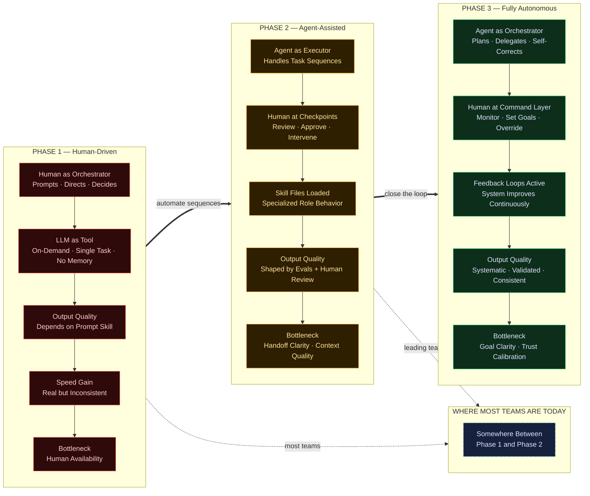
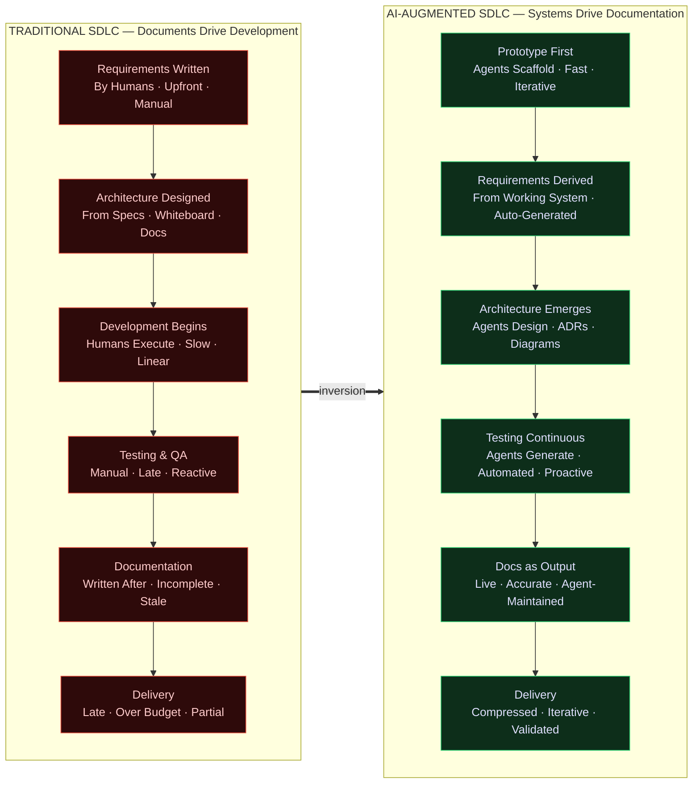
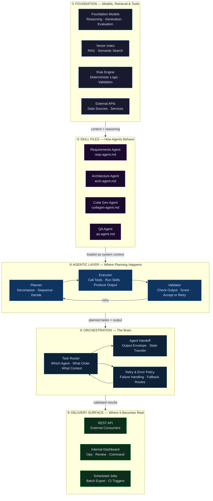
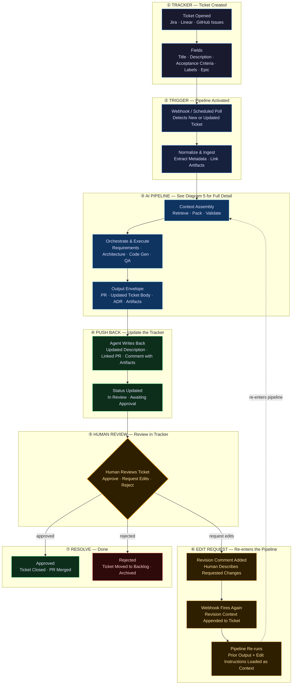
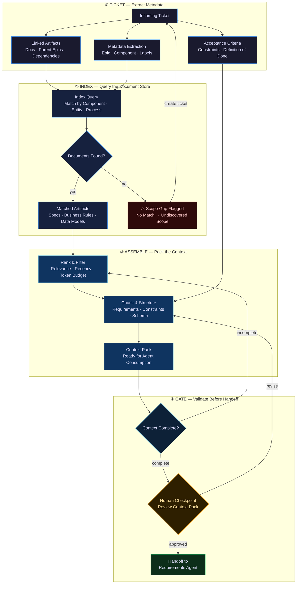
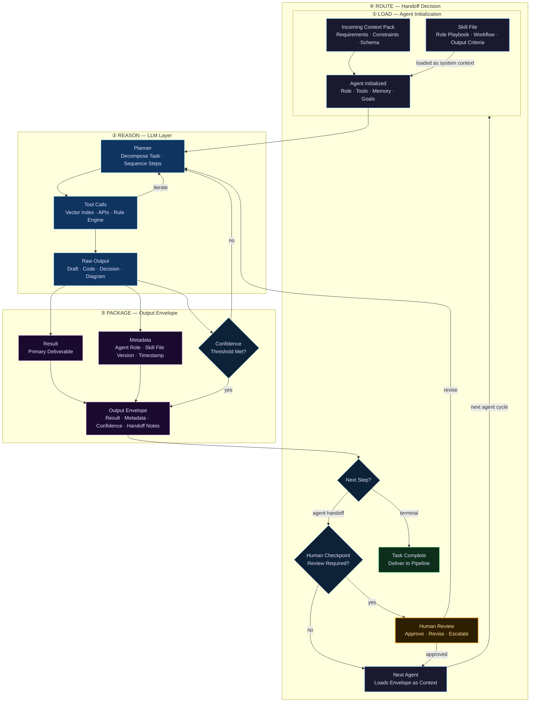
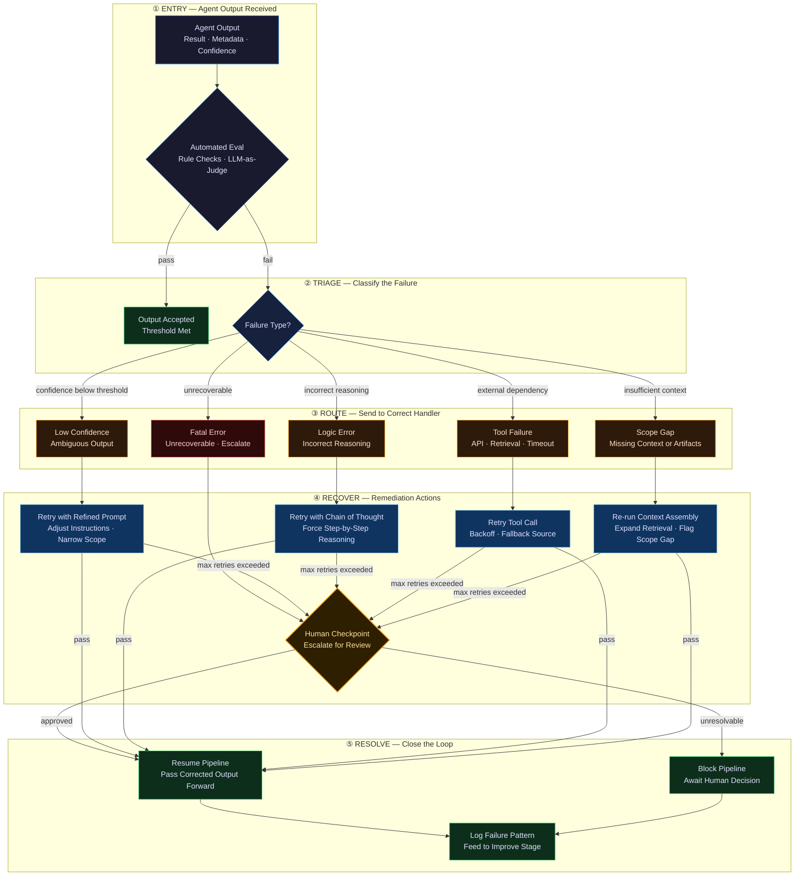
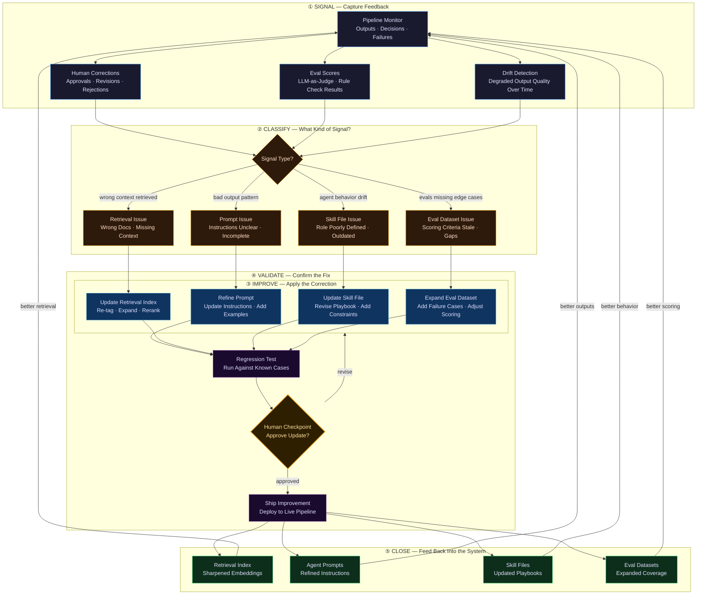

```mermaid
flowchart TD
    subgraph INTAKE["① INTAKE — Discover & Scope"]
        JT[Ticket / Epic\nUser Story · Acceptance Criteria]
        LD[Legacy Artifacts\nDocs · Specs · Business Rules]
        JT -->|linked artifacts| LD
    end

    subgraph INGEST["② INGEST — Normalize"]
        OCR[Document Parser\nExtract → Markdown]
        IDX[Index & Tag\nModule · Process · Entity]
        LD --> OCR --> IDX
        JT -->|ticket context| IDX
    end

    subgraph CONTEXT["③ CONTEXT — Retrieve & Pack"]
        RAG[RAG Retrieval\nQuery by Ticket / Component]
        CTX[Context Pack\nRequirements · Constraints · Schema]
        IDX --> RAG --> CTX
    end

    subgraph ORCHESTRATE["④ ORCHESTRATE — Plan"]
        PLANNER[Requirements Agent\nDecompose · Map · Prioritize]
        HC1{Human Checkpoint\nApprove Requirements}
        ARCH[Architecture Agent\nDesign · ADRs · Diagrams]
        HC2{Human Checkpoint\nApprove Architecture}
        CTX --> PLANNER --> HC1
        HC1 -->|approved| ARCH
        HC1 -->|revise| PLANNER
        ARCH --> HC2
        HC2 -->|revise| ARCH
    end

    subgraph EXECUTE["⑤ EXECUTE — Build"]
        CODEGEN[Code Gen Agent\nScaffold · Implement · Refactor]
        TESTGEN[Test Gen Agent\nUnit · Integration · Contract]
        HC2 -->|approved| CODEGEN
        CODEGEN --> TESTGEN
    end

    subgraph VALIDATE["⑥ VALIDATE — Review"]
        EVAL[Eval Layer\nLLM-as-Judge · Rule Checks]
        QA[QA Agent\nCoverage · Regression · Accessibility]
        HC3{Human Checkpoint\nApprove Release}
        TESTGEN --> EVAL --> QA --> HC3
        HC3 -->|revise| CODEGEN
    end

    subgraph DELIVER["⑦ DELIVER — Ship"]
        PR[Pull Request\nCode · Tests · Docs]
        DEPLOY[CI/CD Pipeline\nBuild · Deploy · Release]
        HC3 -->|approved| PR --> DEPLOY
    end

    subgraph OBSERVE["⑧ OBSERVE — Learn"]
        MON[Monitor\nDrift · Failures · Edge Cases]
        IMPROVE[Improve\nFeed back → Prompts · Index · Evals]
        DEPLOY --> MON --> IMPROVE
        IMPROVE -->|refine retrieval| RAG
        IMPROVE -->|update scope| JT
    end

    classDef intakeStyle fill:#1a1a2e,stroke:#4a9eff,color:#e0e0ff
    classDef ingestStyle fill:#16213e,stroke:#4a9eff,color:#e0e0ff
    classDef contextStyle fill:#0f3460,stroke:#7ec8e3,color:#e0e0ff
    classDef orchStyle fill:#0d2137,stroke:#7ec8e3,color:#e0e0ff
    classDef execStyle fill:#1a0a2e,stroke:#9b59b6,color:#e0e0ff
    classDef valStyle fill:#2e0d1a,stroke:#e74c8b,color:#e0e0ff
    classDef delivStyle fill:#0d2e1a,stroke:#2ecc71,color:#e0e0ff
    classDef obsStyle fill:#2e2a0d,stroke:#f39c12,color:#e0e0ff
    classDef humanStyle fill:#2e1f00,stroke:#f5a623,color:#ffe0a0,stroke-width:2px

    class JT,LD intakeStyle
    class OCR,IDX ingestStyle
    class RAG,CTX contextStyle
    class PLANNER,ARCH orchStyle
    class CODEGEN,TESTGEN execStyle
    class EVAL,QA valStyle
    class PR,DEPLOY delivStyle
    class MON,IMPROVE obsStyle
    class HC1,HC2,HC3 humanStyle
```

# Engineering experiences for people who like their software smart, useful, and a little dangerous.

  

---

**Recent apps**

- 🤖 <a href="https://agent.calabrodesign.com/" target="_blank" rel="noopener noreferrer">Agentic AI</a>
- 🎨 <a href="https://css.calabrodesign.com/" target="_blank" rel="noopener noreferrer">CSS Extractor</a>
- 📄 <a href="https://parser.calabrodesign.com/" target="_blank" rel="noopener noreferrer">Document Parser</a>
- 🍪 <a href="https://crumbs.calabrodesign.com/" target="_blank" rel="noopener noreferrer">CrumbTrail</a>

---

## Architectures & Frameworks

<b>1. Three Phases Maturity Model</b> <i>Mapping the maturity phases from human-driven orchestration to fully autonomous agentic systems.</i>

 

<b>2. SDLC Inversion</b> <i>The paradigm shift from traditional document-driven SDLC to AI-augmented system-driven SDLC.</i>

 

<b>3. Stack Layer Diagram</b> <i>The foundational architecture stack mapping models, skills, agents, orchestration, and surface delivery.</i>

 

<b>4. Ticket Lifecycle & Human Revision Loop</b> <i>The full round-trip of a ticket — from creation in an external tracker, through the AI pipeline, back to the tracker for human review, and re-entry on edit request.</i>

 

<b>5. AI Delivery Pipeline</b> <i>The end-to-end workflow of how tickets and tasks move through the delivery pipeline.</i>

 

<b>6. Context Assembly Flow</b> <i>The process of extracting, indexing, and assembling unstructured tickets into agent-ready context packs.</i>

 

<b>7. Agent Handoff Flow</b> <i>The internal execution loop outlining how a single agent reasons, packages, and routes tasks.</i>

 

<b>8. Retry and Error Routing</b> <i>The evaluation routing and remediation process for correctly handling and recovering from agent failures.</i>

 

<b>9. Feedback Loop</b> <i>The continuous improvement loop for feeding failure patterns and evaluations back into system components.</i>

 

