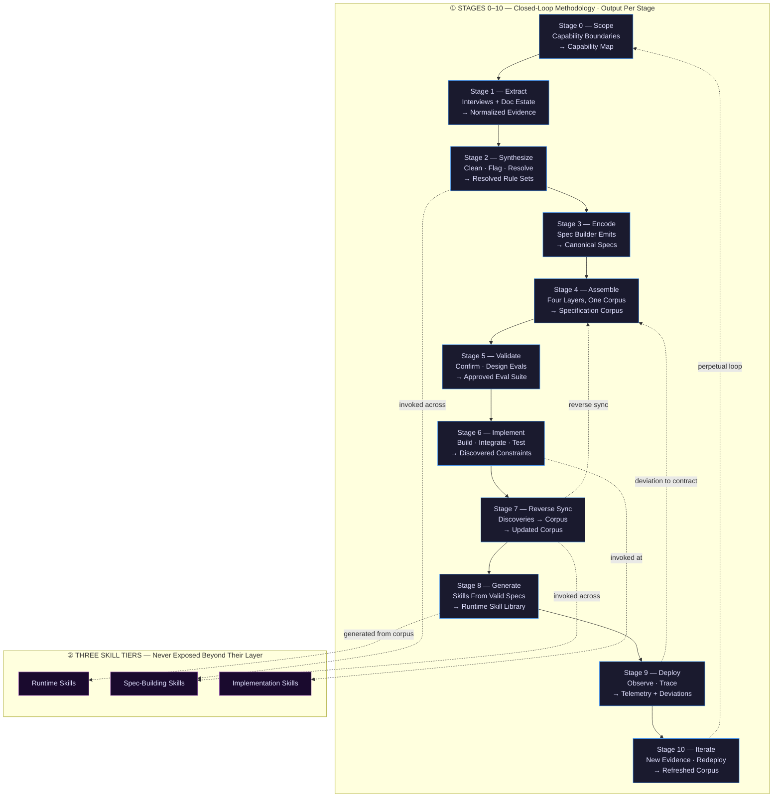
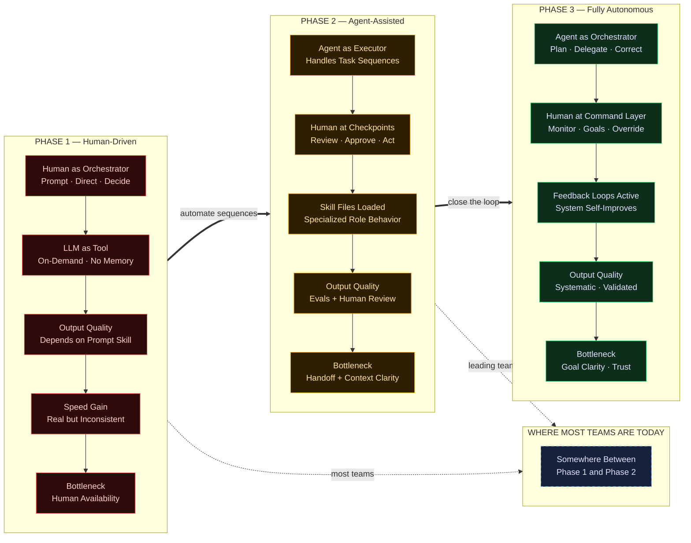
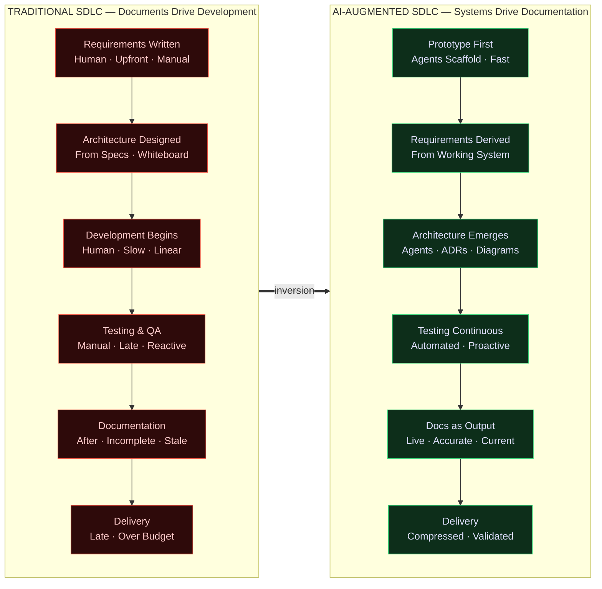
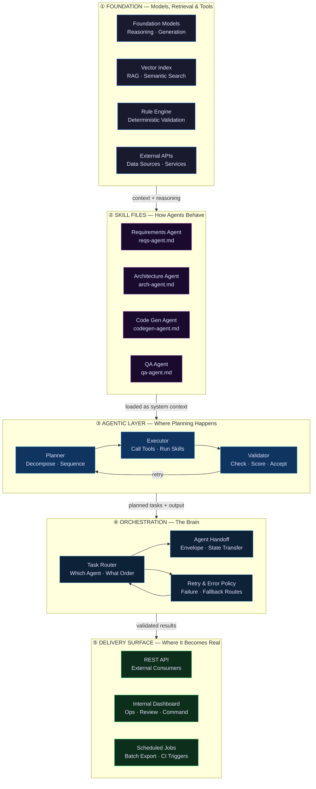
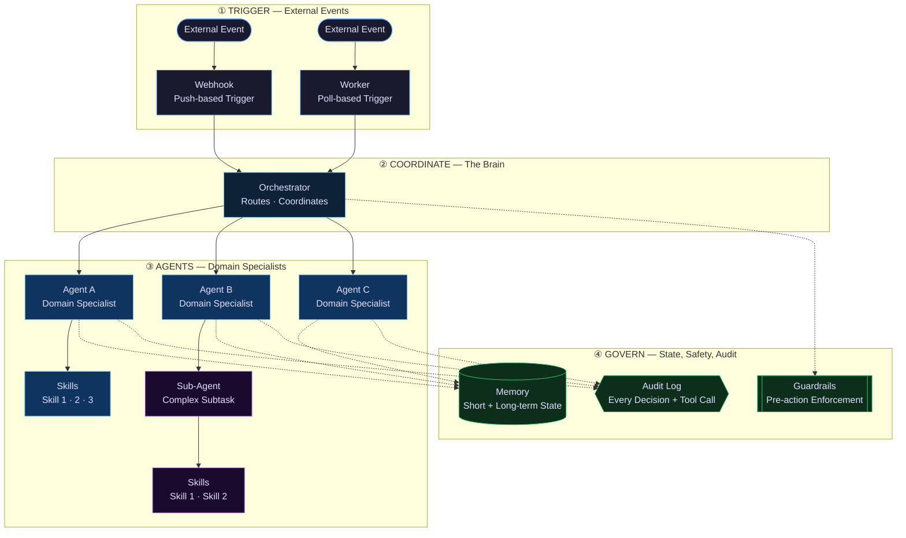
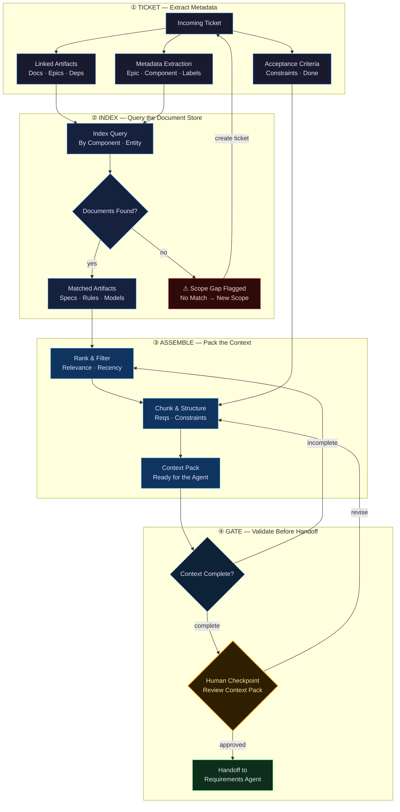
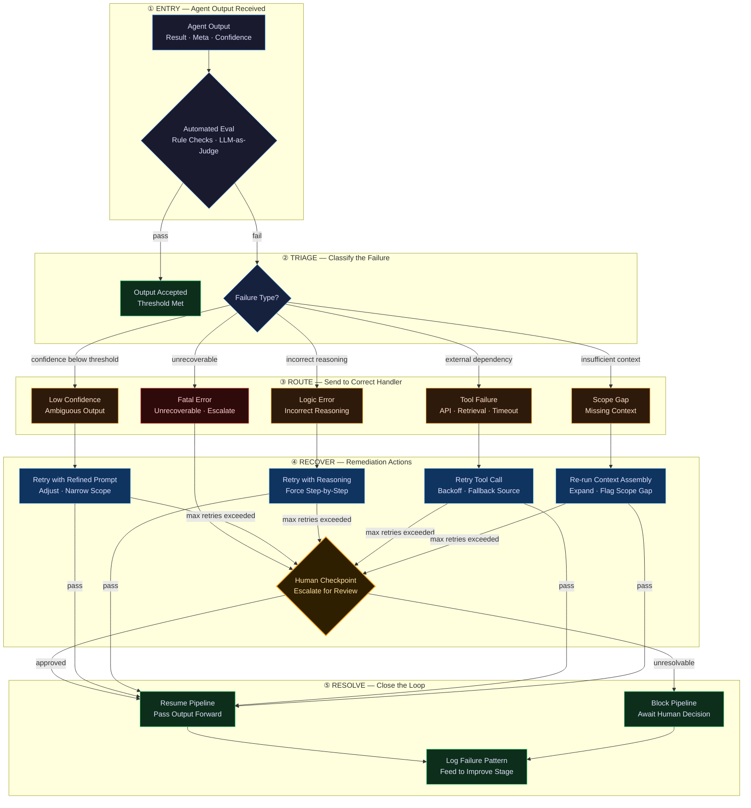
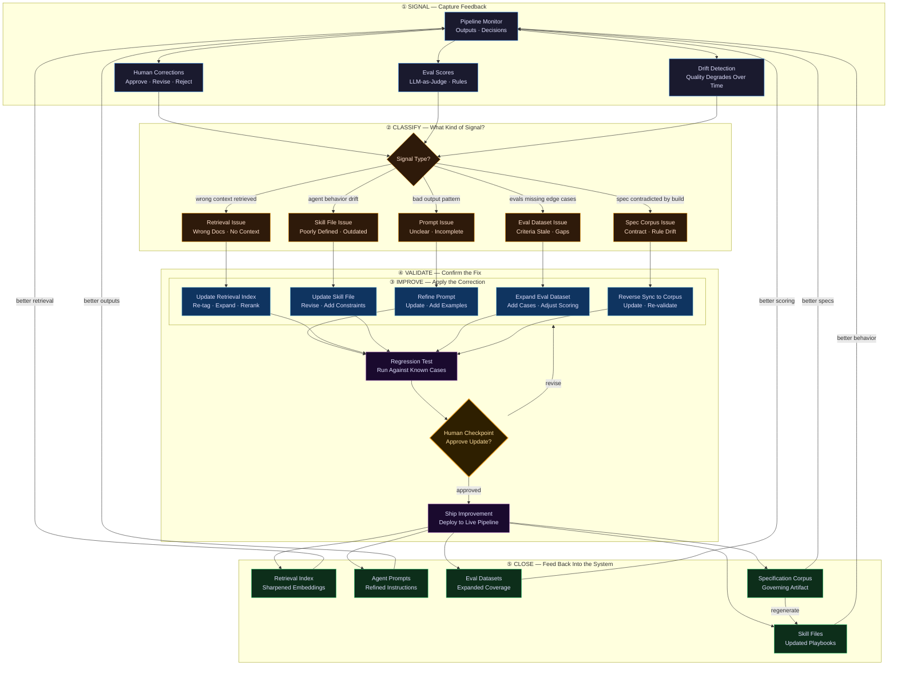

# Solutions that are smart, useful, and a little dangerous.

AI Orchestration &nbsp;|&nbsp; Agent Architecture &nbsp;|&nbsp; Delivery Pipelines

```
                (                   (        )
   (     (      )\ )    (       (   )\ )  ( /(
   )\    )\    (()/(    )\    ( )\ (()/(  )\())
 (((_)((((_)(   /(_))((((_)(  )((_) /(_))((_)\
 )\___ )\ _ )\ (_))   )\ _ )\((_)_ (_))    ((_)
((/ __|(_)_\(_)| |    (_)_\(_)| _ )| _ \  / _ \
 | (__  / _ \  | |__   / _ \  | _ \|   / | (_) |
  \___|/_/ \_\ |____| /_/ \_\ |___/|_|_\  \___/
```

**Recent apps**

| Name                                             | Description                                                                                                                   |
| ------------------------------------------------ | ----------------------------------------------------------------------------------------------------------------------------- |
| [Research](https://research.bryancalabro.com/)   | Curated essay collection and analysis library covering AI, infrastructure, security, design, and emerging technology strategy |
| [Orbital](https://orbital.bryancalabro.com/)     | Editorial-style space app built around NASA's Astronomy Picture of the Day API                                                |
| [Fracta](https://fracta.bryancalabro.com/)       | Mobile-first WebGL fractal explorer for Mandelbrot, Julia, and related complex dynamics                                       |
| [PantryPrice.](https://pantry.bryancalabro.com/) | Approachable dashboard using official Bureau of Labor Statistics data to track the cost of everyday grocery staples           |

## Architectures & Frameworks

<details>
<summary><b>1. Forward Deployed Engineering Methodology</b><br><i>The Stage 0–10 closed-loop process for turning tacit institutional knowledge into production-ready agents, with reverse synchronization returning engineering knowledge to the governing specification corpus.</i></summary>
<br>


```mermaid
flowchart TD
    subgraph LOOP["① STAGES 0–10 — Closed-Loop Methodology · Output Per Stage"]
        direction TB
        S0["Stage 0 — Scope<br/>Capability Boundaries<br/>→ Capability Map"]
        S1["Stage 1 — Extract<br/>Interviews + Doc Estate<br/>→ Normalized Evidence"]
        S2["Stage 2 — Synthesize<br/>Clean · Flag · Resolve<br/>→ Resolved Rule Sets"]
        S3["Stage 3 — Encode<br/>Spec Builder Emits<br/>→ Canonical Specs"]
        S4["Stage 4 — Assemble<br/>Four Layers, One Corpus<br/>→ Specification Corpus"]
        S5["Stage 5 — Validate<br/>Confirm · Design Evals<br/>→ Approved Eval Suite"]
        S6["Stage 6 — Implement<br/>Build · Integrate · Test<br/>→ Discovered Constraints"]
        S7["Stage 7 — Reverse Sync<br/>Discoveries → Corpus<br/>→ Updated Corpus"]
        S8["Stage 8 — Generate<br/>Skills From Valid Specs<br/>→ Runtime Skill Library"]
        S9["Stage 9 — Deploy<br/>Observe · Trace<br/>→ Telemetry + Deviations"]
        S10["Stage 10 — Iterate<br/>New Evidence · Redeploy<br/>→ Refreshed Corpus"]
        S0 --> S1 --> S2 --> S3 --> S4 --> S5 --> S6 --> S7 --> S8 --> S9 --> S10
        S7 -.->|reverse sync| S4
        S9 -.->|deviation to contract| S4
        S10 -.->|perpetual loop| S0
    end

    subgraph TIERS["② THREE SKILL TIERS — Never Exposed Beyond Their Layer"]
        direction TB
        RT[Runtime Skills]
        SB[Spec-Building Skills]
        IM[Implementation Skills]
    end

    S8 -.->|generated from corpus| RT
    S2 -.->|invoked across| SB
    S7 -.->|invoked across| SB
    S6 -.->|invoked at| IM

    classDef loopStyle fill:#1a1a2e,stroke:#4a9eff,color:#e0e0ff
    classDef tierStyle fill:#1a0a2e,stroke:#9b59b6,color:#e0e0ff

    class S0,S1,S2,S3,S4,S5,S6,S7,S8,S9,S10 loopStyle
    class RT,SB,IM tierStyle
```

**Related research:** [Forward Deployed Engineering Methodologies](https://research.bryancalabro.com/papers/forward-deployed-engineering)

</details>

<details>
<summary><b>2. Three Phases Maturity Model</b><br><i>Mapping the maturity phases from human-driven orchestration to fully autonomous agentic systems.</i></summary>
<br>


```mermaid
flowchart LR
    subgraph P1["PHASE 1 — Human-Driven"]
        direction TB
        P1A["Human as Orchestrator<br/>Prompt · Direct · Decide"]
        P1B["LLM as Tool<br/>On-Demand · No Memory"]
        P1C["Output Quality<br/>Depends on Prompt Skill"]
        P1D["Speed Gain<br/>Real but Inconsistent"]
        P1E["Bottleneck<br/>Human Availability"]
        P1A --> P1B --> P1C --> P1D --> P1E
    end

    P1 ==>|automate sequences| P2

    subgraph P2["PHASE 2 — Agent-Assisted"]
        direction TB
        P2A["Agent as Executor<br/>Handles Task Sequences"]
        P2B["Human at Checkpoints<br/>Review · Approve · Act"]
        P2C["Skill Files Loaded<br/>Specialized Role Behavior"]
        P2D["Output Quality<br/>Evals + Human Review"]
        P2E["Bottleneck<br/>Handoff + Context Clarity"]
        P2A --> P2B --> P2C --> P2D --> P2E
    end

    P2 ==>|close the loop| P3

    subgraph P3["PHASE 3 — Fully Autonomous"]
        direction TB
        P3A["Agent as Orchestrator<br/>Plan · Delegate · Correct"]
        P3B["Human at Command Layer<br/>Monitor · Goals · Override"]
        P3C["Feedback Loops Active<br/>System Self-Improves"]
        P3D["Output Quality<br/>Systematic · Validated"]
        P3E["Bottleneck<br/>Goal Clarity · Trust"]
        P3A --> P3B --> P3C --> P3D --> P3E
    end

    subgraph NOW["WHERE MOST TEAMS ARE TODAY"]
        POS["Somewhere Between<br/>Phase 1 and Phase 2"]
    end

    P1 -.->|most teams| NOW
    P2 -.->|leading teams| NOW

    classDef p1Style fill:#2e0a0a,stroke:#e74c3c,color:#ffcccc
    classDef p2Style fill:#2e1f00,stroke:#f5a623,color:#ffe0a0
    classDef p3Style fill:#0d2e1a,stroke:#2ecc71,color:#e0e0ff
    classDef nowStyle fill:#16213e,stroke:#7ec8e3,color:#e0e0ff,stroke-dasharray:5 5

    class P1A,P1B,P1C,P1D,P1E p1Style
    class P2A,P2B,P2C,P2D,P2E p2Style
    class P3A,P3B,P3C,P3D,P3E p3Style
    class POS nowStyle
```

**Related research:** [Earned Autonomy](https://research.bryancalabro.com/papers/earned-autonomy)

</details>

<details>
<summary><b>3. SDLC Inversion</b><br><i>The paradigm shift from traditional document-driven SDLC to AI-augmented system-driven SDLC.</i></summary>
<br>


```mermaid
flowchart LR
    subgraph BEFORE["TRADITIONAL SDLC — Documents Drive Development"]
        direction TB
        B1["Requirements Written<br/>Human · Upfront · Manual"]
        B2["Architecture Designed<br/>From Specs · Whiteboard"]
        B3["Development Begins<br/>Human · Slow · Linear"]
        B4["Testing & QA<br/>Manual · Late · Reactive"]
        B5["Documentation<br/>After · Incomplete · Stale"]
        B6["Delivery<br/>Late · Over Budget"]
        B1 --> B2 --> B3 --> B4 --> B5 --> B6
    end

    BEFORE ==>|inversion| AFTER

    subgraph AFTER["AI-AUGMENTED SDLC — Systems Drive Documentation"]
        direction TB
        A1["Prototype First<br/>Agents Scaffold · Fast"]
        A2["Requirements Derived<br/>From Working System"]
        A3["Architecture Emerges<br/>Agents · ADRs · Diagrams"]
        A4["Testing Continuous<br/>Automated · Proactive"]
        A5["Docs as Output<br/>Live · Accurate · Current"]
        A6["Delivery<br/>Compressed · Validated"]
        A1 --> A2 --> A3 --> A4 --> A5 --> A6
    end

    classDef beforeStyle fill:#2e0a0a,stroke:#e74c3c,color:#ffcccc
    classDef afterStyle fill:#0d2e1a,stroke:#2ecc71,color:#e0e0ff

    class B1,B2,B3,B4,B5,B6 beforeStyle
    class A1,A2,A3,A4,A5,A6 afterStyle
```

**Related research:** [The Inversion of the SDLC](https://research.bryancalabro.com/papers/inversion-sdlc-adlc); [Human-Agent Centered Design](https://research.bryancalabro.com/papers/human-agent-centered-design-in-practice)

</details>

<details>
<summary><b>4. Stack Layer Diagram</b><br><i>The foundational architecture stack mapping models, skills, agents, orchestration, and surface delivery.</i></summary>
<br>


```mermaid
flowchart TD
    subgraph L1["⑤ DELIVERY SURFACE — Where It Becomes Real"]
        API["REST API<br/>External Consumers"]
        DASH["Internal Dashboard<br/>Ops · Review · Command"]
        BATCH["Scheduled Jobs<br/>Batch Export · CI Triggers"]
    end

    subgraph L2["④ ORCHESTRATION — The Brain"]
        ROUTER["Task Router<br/>Which Agent · What Order"]
        RETRY["Retry & Error Policy<br/>Failure · Fallback Routes"]
        HANDOFF["Agent Handoff<br/>Envelope · State Transfer"]
        ROUTER --> HANDOFF
        ROUTER --> RETRY
        RETRY --> ROUTER
    end

    subgraph L3["③ AGENTIC LAYER — Where Planning Happens"]
        PLANNER["Planner<br/>Decompose · Sequence"]
        EXECUTOR["Executor<br/>Call Tools · Run Skills"]
        VALIDATOR["Validator<br/>Check · Score · Accept"]
        PLANNER --> EXECUTOR --> VALIDATOR
        VALIDATOR -->|retry| PLANNER
    end

    subgraph L4["② SKILL FILES — How Agents Behave"]
        REQ["Requirements Agent<br/>reqs-agent.md"]
        ARCH["Architecture Agent<br/>arch-agent.md"]
        CODE["Code Gen Agent<br/>codegen-agent.md"]
        QA["QA Agent<br/>qa-agent.md"]
    end

    subgraph L5["① FOUNDATION — Models, Retrieval & Tools"]
        LLM["Foundation Models<br/>Reasoning · Generation"]
        VEC["Vector Index<br/>RAG · Semantic Search"]
        RULES["Rule Engine<br/>Deterministic Validation"]
        APIS["External APIs<br/>Data Sources · Services"]
    end

    L5 -->|context + reasoning| L4
    L4 -->|loaded as system context| L3
    L3 -->|planned tasks + output| L2
    L2 -->|validated results| L1

    classDef l1Style fill:#0d2e1a,stroke:#2ecc71,color:#e0e0ff
    classDef l2Style fill:#0d2137,stroke:#7ec8e3,color:#e0e0ff
    classDef l3Style fill:#0f3460,stroke:#7ec8e3,color:#e0e0ff
    classDef l4Style fill:#1a0a2e,stroke:#9b59b6,color:#e0e0ff
    classDef l5Style fill:#1a1a2e,stroke:#4a9eff,color:#e0e0ff

    class API,DASH,BATCH l1Style
    class ROUTER,RETRY,HANDOFF l2Style
    class PLANNER,EXECUTOR,VALIDATOR l3Style
    class REQ,ARCH,CODE,QA l4Style
    class LLM,VEC,RULES,APIS l5Style
```

**Related research:** [The Nervous System of Agentic AI](https://research.bryancalabro.com/papers/agentic-ai-sensing); [Forward Deployed Engineering Methodologies](https://research.bryancalabro.com/papers/forward-deployed-engineering)

</details>

<details>
<summary><b>5. Agent System Topology</b><br><i>The runtime topology of an agentic system — how triggers, orchestration, agents, skills, and governance fit together.</i></summary>
<br>


```mermaid
flowchart TD
    subgraph TRIGGER["① TRIGGER — External Events"]
        EV1([External Event])
        EV2([External Event])
        WH["Webhook<br/>Push-based Trigger"]
        WK["Worker<br/>Poll-based Trigger"]
        EV1 --> WH
        EV2 --> WK
    end

    subgraph COORD["② COORDINATE — The Brain"]
        ORC["Orchestrator<br/>Routes · Coordinates"]
        WH --> ORC
        WK --> ORC
    end

    subgraph AGENTS["③ AGENTS — Domain Specialists"]
        AGa["Agent A<br/>Domain Specialist"]
        AGb["Agent B<br/>Domain Specialist"]
        AGc["Agent C<br/>Domain Specialist"]
        SKa["Skills<br/>Skill 1 · 2 · 3"]
        SUB["Sub-Agent<br/>Complex Subtask"]
        SKb["Skills<br/>Skill 1 · Skill 2"]
        ORC --> AGa
        ORC --> AGb
        ORC --> AGc
        AGa --> SKa
        AGb --> SUB
        SUB --> SKb
    end

    subgraph GOVERN["④ GOVERN — State, Safety, Audit"]
        MEM[("Memory<br/>Short + Long-term State")]
        GRD[["Guardrails<br/>Pre-action Enforcement"]]
        AUD{{"Audit Log<br/>Every Decision + Tool Call"}}
        ORC -.-> GRD
        AGa -.-> MEM
        AGb -.-> MEM
        AGc -.-> MEM
        AGa -.-> AUD
        AGb -.-> AUD
        AGc -.-> AUD
    end

    classDef triggerStyle fill:#1a1a2e,stroke:#4a9eff,color:#e0e0ff
    classDef coordStyle fill:#0d2137,stroke:#7ec8e3,color:#e0e0ff
    classDef agentStyle fill:#0f3460,stroke:#7ec8e3,color:#e0e0ff
    classDef subStyle fill:#1a0a2e,stroke:#9b59b6,color:#e0e0ff
    classDef governStyle fill:#0d2e1a,stroke:#2ecc71,color:#e0e0ff

    class EV1,EV2,WH,WK triggerStyle
    class ORC coordStyle
    class AGa,AGb,AGc,SKa agentStyle
    class SUB,SKb subStyle
    class MEM,GRD,AUD governStyle
```

**Related research:** [Greenfield Versus Brownfield Agentic AI Integration](https://research.bryancalabro.com/papers/greenfield-vs-brownfield-agentic-ai-integration); [Earned Autonomy](https://research.bryancalabro.com/papers/earned-autonomy)

</details>

<details>
<summary><b>6. Ticket Lifecycle & Human Revision Loop</b><br><i>The full round-trip of a ticket — from creation in an external tracker, through the AI pipeline, back to the tracker for human review, and re-entry on edit request.</i></summary>
<br>


```mermaid
flowchart TD
    subgraph TRACKER["① TRACKER — Ticket Created"]
        TK["Ticket Opened<br/>Jira · Linear · GitHub"]
        TF["Fields<br/>Title · Criteria · Epic"]
        TK --> TF
    end

    subgraph TRIGGER["② TRIGGER — Pipeline Activated"]
        WH["Webhook / Scheduled Poll<br/>Detects Ticket Changes"]
        NRM["Normalize & Ingest<br/>Extract · Link Artifacts"]
        TF --> WH --> NRM
    end

    subgraph PIPELINE["③ AI PIPELINE — See Diagram 5 for Full Detail"]
        CTX["Context Assembly<br/>Retrieve · Pack · Validate"]
        ORCH["Orchestrate & Execute<br/>Reqs · Arch · Code · QA"]
        ENV["Output Envelope<br/>PR · Ticket · ADR · Files"]
        NRM --> CTX --> ORCH --> ENV
    end

    subgraph PUSHBACK["④ PUSH BACK — Update the Tracker"]
        UPD["Agent Writes Back<br/>Description · PR · Comment"]
        STAT["Status Updated<br/>In Review · Awaiting OK"]
        ENV --> UPD --> STAT
    end

    subgraph REVIEW["⑤ HUMAN REVIEW — Review in Tracker"]
        HR{"Human Reviews Ticket<br/>Approve · Edit · Reject"}
        STAT --> HR
    end

    subgraph EDITLOOP["⑥ EDIT REQUEST — Re-enters the Pipeline"]
        EC["Revision Comment Added<br/>Human Describes Changes"]
        WH2["Webhook Fires Again<br/>Revision Context Added"]
        RELOAD["Pipeline Re-runs<br/>Prior Output + Edits"]
        EC --> WH2 --> RELOAD
    end

    subgraph RESOLVE["⑦ RESOLVE — Done"]
        APPROVE["Approved<br/>Ticket Closed · PR Merged"]
        REJECT["Rejected<br/>To Backlog · Archived"]
        HR -->|approved| APPROVE
        HR -->|rejected| REJECT
    end

    HR -->|request edits| EC
    RELOAD -.->|re-enters pipeline| CTX

    classDef trackerStyle fill:#1a1a2e,stroke:#4a9eff,color:#e0e0ff
    classDef triggerStyle fill:#16213e,stroke:#4a9eff,color:#e0e0ff
    classDef pipelineStyle fill:#0f3460,stroke:#7ec8e3,color:#e0e0ff
    classDef pushbackStyle fill:#0d2e1a,stroke:#2ecc71,color:#e0e0ff
    classDef humanStyle fill:#2e1f00,stroke:#f5a623,color:#ffe0a0,stroke-width:2px
    classDef editStyle fill:#2e1f00,stroke:#f5a623,color:#ffe0a0
    classDef resolveStyle fill:#0d2e1a,stroke:#2ecc71,color:#e0e0ff
    classDef rejectStyle fill:#2e0a0a,stroke:#e74c3c,color:#ffcccc

    class TK,TF trackerStyle
    class WH,NRM triggerStyle
    class CTX,ORCH,ENV pipelineStyle
    class UPD,STAT pushbackStyle
    class HR humanStyle
    class EC,WH2,RELOAD editStyle
    class APPROVE resolveStyle
    class REJECT rejectStyle
```

**Related research:** [Human-Agent Centered Design](https://research.bryancalabro.com/papers/human-agent-centered-design-in-practice); [The Inversion of the SDLC](https://research.bryancalabro.com/papers/inversion-sdlc-adlc)

</details>

<details>
<summary><b>7. AI Delivery Pipeline</b><br><i>The end-to-end workflow of how tickets and tasks move through the delivery pipeline.</i></summary>
<br>


```mermaid
flowchart TD
    subgraph INTAKE["① INTAKE — Discover & Scope"]
        JT["Ticket / Epic<br/>User Story · Criteria"]
        LD["Legacy Artifacts<br/>Docs · Specs · Rules"]
        JT -->|linked artifacts| LD
    end

    subgraph INGEST["② INGEST — Normalize"]
        OCR["Document Parser<br/>Extract → Markdown"]
        IDX["Index & Tag<br/>Module · Process · Entity"]
        LD --> OCR --> IDX
        JT -->|ticket context| IDX
    end

    subgraph CONTEXT["③ CONTEXT — Retrieve & Pack"]
        RAG["RAG Retrieval<br/>By Ticket / Component"]
        CTX["Context Pack<br/>Reqs · Constraints"]
        IDX --> RAG --> CTX
    end

    subgraph ORCHESTRATE["④ ORCHESTRATE — Plan"]
        PLANNER["Requirements Agent<br/>Decompose · Map · Rank"]
        HC1{"Human Checkpoint<br/>Approve Requirements"}
        ARCH["Architecture Agent<br/>Design · ADRs · Diagrams"]
        HC2{"Human Checkpoint<br/>Approve Architecture"}
        CTX --> PLANNER --> HC1
        HC1 -->|approved| ARCH
        HC1 -->|revise| PLANNER
        ARCH --> HC2
        HC2 -->|revise| ARCH
    end

    subgraph EXECUTE["⑤ EXECUTE — Build"]
        CODEGEN["Code Gen Agent<br/>Scaffold · Implement"]
        TESTGEN["Test Gen Agent<br/>Unit · Integration"]
        HC2 -->|approved| CODEGEN
        CODEGEN --> TESTGEN
    end

    subgraph VALIDATE["⑥ VALIDATE — Review"]
        EVAL["Eval Layer<br/>LLM-as-Judge · Rule Checks"]
        QA["QA Agent<br/>Coverage · Regression"]
        HC3{"Human Checkpoint<br/>Approve Release"}
        TESTGEN --> EVAL --> QA --> HC3
        HC3 -->|revise| CODEGEN
    end

    subgraph DELIVER["⑦ DELIVER — Ship"]
        PR["Pull Request<br/>Code · Tests · Docs"]
        DEPLOY["CI/CD Pipeline<br/>Build · Deploy · Release"]
        HC3 -->|approved| PR --> DEPLOY
    end

    subgraph OBSERVE["⑧ OBSERVE — Learn"]
        MON["Monitor<br/>Drift · Failures · Edges"]
        IMPROVE["Improve<br/>→ Prompts · Index · Evals"]
        DEPLOY --> MON --> IMPROVE
        IMPROVE -->|refine retrieval| RAG
        IMPROVE -->|update scope| JT
    end

    classDef intakeStyle fill:#1a1a2e,stroke:#4a9eff,color:#e0e0ff
    classDef ingestStyle fill:#16213e,stroke:#4a9eff,color:#e0e0ff
    classDef contextStyle fill:#0f3460,stroke:#7ec8e3,color:#e0e0ff
    classDef orchStyle fill:#0d2137,stroke:#7ec8e3,color:#e0e0ff
    classDef execStyle fill:#1a0a2e,stroke:#9b59b6,color:#e0e0ff
    classDef valStyle fill:#2e0d1a,stroke:#e74c8b,color:#e0e0ff
    classDef delivStyle fill:#0d2e1a,stroke:#2ecc71,color:#e0e0ff
    classDef obsStyle fill:#2e2a0d,stroke:#f39c12,color:#e0e0ff
    classDef humanStyle fill:#2e1f00,stroke:#f5a623,color:#ffe0a0,stroke-width:2px

    class JT,LD intakeStyle
    class OCR,IDX ingestStyle
    class RAG,CTX contextStyle
    class PLANNER,ARCH orchStyle
    class CODEGEN,TESTGEN execStyle
    class EVAL,QA valStyle
    class PR,DEPLOY delivStyle
    class MON,IMPROVE obsStyle
    class HC1,HC2,HC3 humanStyle
```

**Related research:** [The Inversion of the SDLC](https://research.bryancalabro.com/papers/inversion-sdlc-adlc); [Forward Deployed Engineering Methodologies](https://research.bryancalabro.com/papers/forward-deployed-engineering)

</details>

<details>
<summary><b>8. Context Assembly Flow</b><br><i>The process of extracting, indexing, and assembling unstructured tickets into agent-ready context packs.</i></summary>
<br>


```mermaid
flowchart TD
    subgraph TICKET["① TICKET — Extract Metadata"]
        TK[Incoming Ticket]
        TM["Metadata Extraction<br/>Epic · Component · Labels"]
        AC["Acceptance Criteria<br/>Constraints · Done"]
        LK["Linked Artifacts<br/>Docs · Epics · Deps"]
        TK --> TM
        TK --> AC
        TK --> LK
    end

    subgraph INDEX["② INDEX — Query the Document Store"]
        QRY["Index Query<br/>By Component · Entity"]
        HIT{Documents Found?}
        MATCH["Matched Artifacts<br/>Specs · Rules · Models"]
        FLAG["⚠ Scope Gap Flagged<br/>No Match → New Scope"]
        LK --> QRY
        TM --> QRY
        QRY --> HIT
        HIT -->|yes| MATCH
        HIT -->|no| FLAG
        FLAG -->|create ticket| TK
    end

    subgraph ASSEMBLE["③ ASSEMBLE — Pack the Context"]
        RANK["Rank & Filter<br/>Relevance · Recency"]
        CHUNK["Chunk & Structure<br/>Reqs · Constraints"]
        CTX["Context Pack<br/>Ready for the Agent"]
        MATCH --> RANK --> CHUNK --> CTX
        AC --> CHUNK
    end

    subgraph GATE["④ GATE — Validate Before Handoff"]
        CHK{Context Complete?}
        HC{"Human Checkpoint<br/>Review Context Pack"}
        READY["Handoff to<br/>Requirements Agent"]
        CHK -->|incomplete| RANK
        CTX --> CHK
        CHK -->|complete| HC
        HC -->|approved| READY
        HC -->|revise| CHUNK
    end

    classDef ticketStyle fill:#1a1a2e,stroke:#4a9eff,color:#e0e0ff
    classDef indexStyle fill:#16213e,stroke:#4a9eff,color:#e0e0ff
    classDef assembleStyle fill:#0f3460,stroke:#7ec8e3,color:#e0e0ff
    classDef gateStyle fill:#0d2137,stroke:#7ec8e3,color:#e0e0ff
    classDef flagStyle fill:#2e0a0a,stroke:#e74c3c,color:#ffcccc
    classDef humanStyle fill:#2e1f00,stroke:#f5a623,color:#ffe0a0,stroke-width:2px
    classDef readyStyle fill:#0d2e1a,stroke:#2ecc71,color:#e0e0ff

    class TK,TM,AC,LK ticketStyle
    class QRY,HIT,MATCH indexStyle
    class RANK,CHUNK,CTX assembleStyle
    class CHK gateStyle
    class FLAG flagStyle
    class HC humanStyle
    class READY readyStyle
```

**Related research:** [Forward Deployed Engineering Methodologies](https://research.bryancalabro.com/papers/forward-deployed-engineering); [The Inversion of the SDLC](https://research.bryancalabro.com/papers/inversion-sdlc-adlc)

</details>

<details>
<summary><b>9. Agent Handoff Flow</b><br><i>The internal execution loop outlining how a single agent reasons, packages, and routes tasks.</i></summary>
<br>


```mermaid
flowchart TD
    subgraph LOAD["① LOAD — Agent Initialization"]
        CTX["Incoming Context Pack<br/>Reqs · Constraints"]
        SF["Skill File<br/>Playbook · Workflow"]
        INIT["Agent Initialized<br/>Role · Tools · Memory"]
        CTX --> INIT
        SF -->|loaded as system context| INIT
    end

    subgraph REASON["② REASON — LLM Layer"]
        PLAN["Planner<br/>Decompose · Sequence"]
        TOOLS["Tool Calls<br/>Index · APIs · Rules"]
        OUT["Raw Output<br/>Draft · Code · Decision"]
        INIT --> PLAN --> TOOLS --> OUT
        TOOLS -->|iterate| PLAN
    end

    subgraph PACKAGE["③ PACKAGE — Output Envelope"]
        RES["Result<br/>Primary Deliverable"]
        META["Metadata<br/>Role · Version · Time"]
        CONF{"Confidence<br/>Threshold Met?"}
        ENV["Output Envelope<br/>Result · Metadata · Notes"]
        OUT --> RES
        OUT --> META
        OUT --> CONF
        CONF -->|no| PLAN
        RES --> ENV
        META --> ENV
        CONF -->|yes| ENV
    end

    subgraph ROUTE["④ ROUTE — Handoff Decision"]
        RTR{Next Step?}
        HC{"Human Checkpoint<br/>Review Required?"}
        NEXT["Next Agent<br/>Loads Envelope as Context"]
        HUMAN["Human Review<br/>Approve · Revise"]
        DONE["Task Complete<br/>Deliver to Pipeline"]
        ENV --> RTR
        RTR -->|agent handoff| HC
        HC -->|no| NEXT
        HC -->|yes| HUMAN
        HUMAN -->|approved| NEXT
        HUMAN -->|revise| PLAN
        RTR -->|terminal| DONE
        NEXT -->|next agent cycle| LOAD
    end

    classDef loadStyle fill:#1a1a2e,stroke:#4a9eff,color:#e0e0ff
    classDef reasonStyle fill:#0f3460,stroke:#7ec8e3,color:#e0e0ff
    classDef packageStyle fill:#1a0a2e,stroke:#9b59b6,color:#e0e0ff
    classDef routeStyle fill:#0d2137,stroke:#7ec8e3,color:#e0e0ff
    classDef humanStyle fill:#2e1f00,stroke:#f5a623,color:#ffe0a0,stroke-width:2px
    classDef doneStyle fill:#0d2e1a,stroke:#2ecc71,color:#e0e0ff
    classDef flagStyle fill:#2e0a0a,stroke:#e74c3c,color:#ffcccc

    class CTX,SF,INIT loadStyle
    class PLAN,TOOLS,OUT reasonStyle
    class RES,META,ENV packageStyle
    class CONF,RTR,HC routeStyle
    class HUMAN humanStyle
    class DONE doneStyle
    class NEXT loadStyle
```

**Related research:** [Human-Agent Centered Design](https://research.bryancalabro.com/papers/human-agent-centered-design-in-practice); [The Inversion of the SDLC](https://research.bryancalabro.com/papers/inversion-sdlc-adlc)

</details>

<details>
<summary><b>10. Retry and Error Routing</b><br><i>The evaluation routing and remediation process for correctly handling and recovering from agent failures.</i></summary>
<br>


```mermaid
flowchart TD
    subgraph ENTRY["① ENTRY — Agent Output Received"]
        OUT["Agent Output<br/>Result · Meta · Confidence"]
        EVAL{"Automated Eval<br/>Rule Checks · LLM-as-Judge"}
        OUT --> EVAL
    end

    subgraph TRIAGE["② TRIAGE — Classify the Failure"]
        PASS["Output Accepted<br/>Threshold Met"]
        FAIL{Failure Type?}
        EVAL -->|pass| PASS
        EVAL -->|fail| FAIL
    end

    subgraph ROUTES["③ ROUTE — Send to Correct Handler"]
        LOW["Low Confidence<br/>Ambiguous Output"]
        LOGIC["Logic Error<br/>Incorrect Reasoning"]
        TOOL["Tool Failure<br/>API · Retrieval · Timeout"]
        SCOPE["Scope Gap<br/>Missing Context"]
        FATAL["Fatal Error<br/>Unrecoverable · Escalate"]
        FAIL -->|confidence below threshold| LOW
        FAIL -->|incorrect reasoning| LOGIC
        FAIL -->|external dependency| TOOL
        FAIL -->|insufficient context| SCOPE
        FAIL -->|unrecoverable| FATAL
    end

    subgraph RECOVER["④ RECOVER — Remediation Actions"]
        R1["Retry with Refined Prompt<br/>Adjust · Narrow Scope"]
        R2["Retry with Reasoning<br/>Force Step-by-Step"]
        R3["Retry Tool Call<br/>Backoff · Fallback Source"]
        R4["Re-run Context Assembly<br/>Expand · Flag Scope Gap"]
        HC{"Human Checkpoint<br/>Escalate for Review"}
        LOW --> R1
        LOGIC --> R2
        TOOL --> R3
        SCOPE --> R4
        FATAL --> HC
        R1 -->|max retries exceeded| HC
        R2 -->|max retries exceeded| HC
        R3 -->|max retries exceeded| HC
        R4 -->|max retries exceeded| HC
    end

    subgraph RESOLVE["⑤ RESOLVE — Close the Loop"]
        RESUME["Resume Pipeline<br/>Pass Output Forward"]
        LOG["Log Failure Pattern<br/>Feed to Improve Stage"]
        BLOCK["Block Pipeline<br/>Await Human Decision"]
        HC -->|approved| RESUME
        HC -->|unresolvable| BLOCK
        R1 -->|pass| RESUME
        R2 -->|pass| RESUME
        R3 -->|pass| RESUME
        R4 -->|pass| RESUME
        RESUME --> LOG
        BLOCK --> LOG
    end

    classDef entryStyle fill:#1a1a2e,stroke:#4a9eff,color:#e0e0ff
    classDef triageStyle fill:#16213e,stroke:#4a9eff,color:#e0e0ff
    classDef routeStyle fill:#2e1a0a,stroke:#f39c12,color:#ffe0cc
    classDef recoverStyle fill:#0f3460,stroke:#7ec8e3,color:#e0e0ff
    classDef resolveStyle fill:#0d2e1a,stroke:#2ecc71,color:#e0e0ff
    classDef failStyle fill:#2e0a0a,stroke:#e74c3c,color:#ffcccc
    classDef humanStyle fill:#2e1f00,stroke:#f5a623,color:#ffe0a0,stroke-width:2px
    classDef passStyle fill:#0d2e1a,stroke:#2ecc71,color:#e0e0ff

    class OUT,EVAL entryStyle
    class PASS,FAIL triageStyle
    class LOW,LOGIC,TOOL,SCOPE routeStyle
    class FATAL failStyle
    class R1,R2,R3,R4 recoverStyle
    class HC humanStyle
    class RESUME,LOG,BLOCK resolveStyle
    class PASS passStyle
```

**Related research:** [Earned Autonomy](https://research.bryancalabro.com/papers/earned-autonomy); [The Inversion of the SDLC](https://research.bryancalabro.com/papers/inversion-sdlc-adlc)

</details>

<details>
<summary><b>11. Feedback Loop</b><br><i>The continuous improvement loop for feeding failure patterns and evaluations back into system components.</i></summary>
<br>


```mermaid
flowchart TD
    subgraph SIGNAL["① SIGNAL — Capture Feedback"]
        MON["Pipeline Monitor<br/>Outputs · Decisions"]
        HF["Human Corrections<br/>Approve · Revise · Reject"]
        EVAL["Eval Scores<br/>LLM-as-Judge · Rules"]
        DRIFT["Drift Detection<br/>Quality Degrades Over Time"]
        MON --> HF
        MON --> EVAL
        MON --> DRIFT
    end

    subgraph CLASSIFY["② CLASSIFY — What Kind of Signal?"]
        RTR{Signal Type?}
        HF --> RTR
        EVAL --> RTR
        DRIFT --> RTR
        PROMPT["Prompt Issue<br/>Unclear · Incomplete"]
        RETRIEVE["Retrieval Issue<br/>Wrong Docs · No Context"]
        SKILL["Skill File Issue<br/>Poorly Defined · Outdated"]
        EVALDS["Eval Dataset Issue<br/>Criteria Stale · Gaps"]
        SPEC["Spec Corpus Issue<br/>Contract · Rule Drift"]
        RTR -->|bad output pattern| PROMPT
        RTR -->|wrong context retrieved| RETRIEVE
        RTR -->|agent behavior drift| SKILL
        RTR -->|evals missing edge cases| EVALDS
        RTR -->|spec contradicted by build| SPEC
    end

    subgraph IMPROVE["③ IMPROVE — Apply the Correction"]
        UP1["Refine Prompt<br/>Update · Add Examples"]
        UP2["Update Retrieval Index<br/>Re-tag · Expand · Rerank"]
        UP3["Update Skill File<br/>Revise · Add Constraints"]
        UP4["Expand Eval Dataset<br/>Add Cases · Adjust Scoring"]
        UP5["Reverse Sync to Corpus<br/>Update · Re-validate"]
        PROMPT --> UP1
        RETRIEVE --> UP2
        SKILL --> UP3
        EVALDS --> UP4
        SPEC --> UP5
    end

    subgraph VALIDATE["④ VALIDATE — Confirm the Fix"]
        TEST["Regression Test<br/>Run Against Known Cases"]
        HC{"Human Checkpoint<br/>Approve Update?"}
        SHIP["Ship Improvement<br/>Deploy to Live Pipeline"]
        UP1 --> TEST
        UP2 --> TEST
        UP3 --> TEST
        UP4 --> TEST
        UP5 --> TEST
        TEST --> HC
        HC -->|revise| IMPROVE
        HC -->|approved| SHIP
    end

    subgraph CLOSE["⑤ CLOSE — Feed Back Into the System"]
        IDX["Retrieval Index<br/>Sharpened Embeddings"]
        PROMPTS["Agent Prompts<br/>Refined Instructions"]
        SKILLS["Skill Files<br/>Updated Playbooks"]
        EVALS["Eval Datasets<br/>Expanded Coverage"]
        SPECS["Specification Corpus<br/>Governing Artifact"]
        SHIP --> IDX
        SHIP --> PROMPTS
        SHIP --> SKILLS
        SHIP --> EVALS
        SHIP --> SPECS
        IDX -->|better retrieval| MON
        PROMPTS -->|better outputs| MON
        SKILLS -->|better behavior| MON
        EVALS -->|better scoring| MON
        SPECS -->|regenerate| SKILLS
        SPECS -->|better specs| MON
    end

    classDef signalStyle fill:#1a1a2e,stroke:#4a9eff,color:#e0e0ff
    classDef classifyStyle fill:#2e1a0a,stroke:#f39c12,color:#ffe0cc
    classDef improveStyle fill:#0f3460,stroke:#7ec8e3,color:#e0e0ff
    classDef validateStyle fill:#1a0a2e,stroke:#9b59b6,color:#e0e0ff
    classDef closeStyle fill:#0d2e1a,stroke:#2ecc71,color:#e0e0ff
    classDef humanStyle fill:#2e1f00,stroke:#f5a623,color:#ffe0a0,stroke-width:2px

    class MON,HF,EVAL,DRIFT signalStyle
    class RTR,PROMPT,RETRIEVE,SKILL,EVALDS,SPEC classifyStyle
    class UP1,UP2,UP3,UP4,UP5 improveStyle
    class TEST,SHIP validateStyle
    class IDX,PROMPTS,SKILLS,EVALS,SPECS closeStyle
    class HC humanStyle
```

**Related research:** [Earned Autonomy](https://research.bryancalabro.com/papers/earned-autonomy); [Forward Deployed Engineering Methodologies](https://research.bryancalabro.com/papers/forward-deployed-engineering)

</details>
