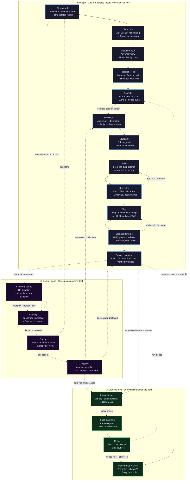
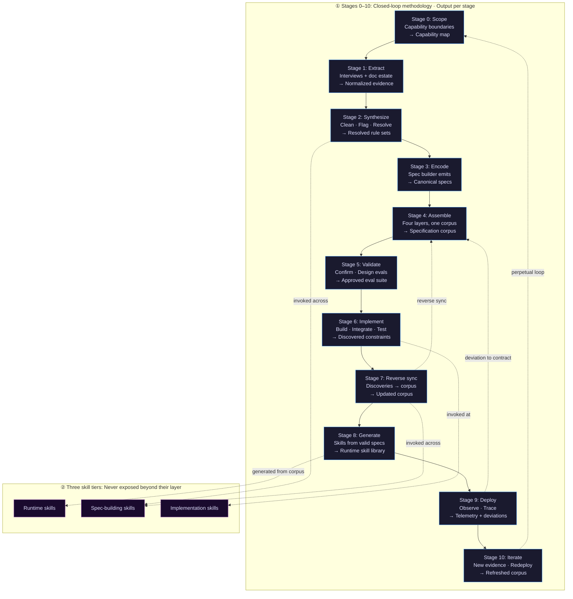
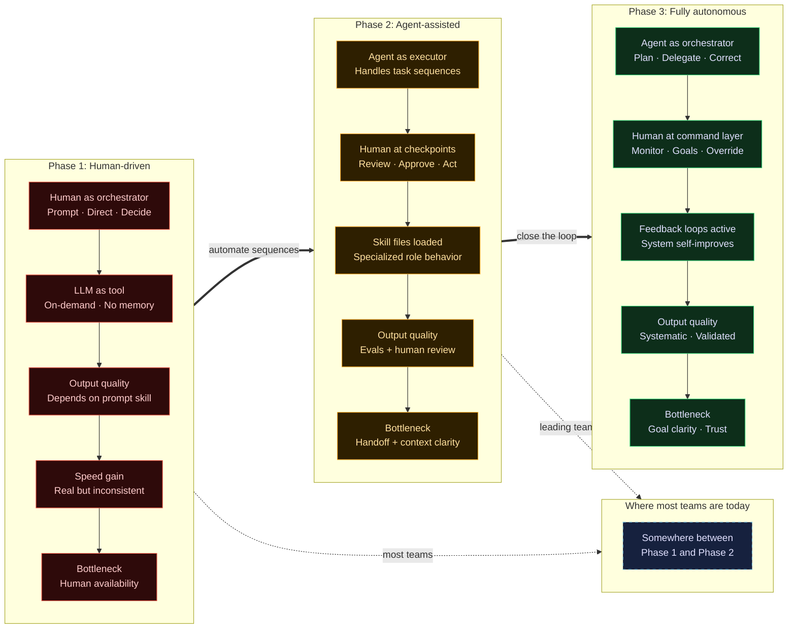
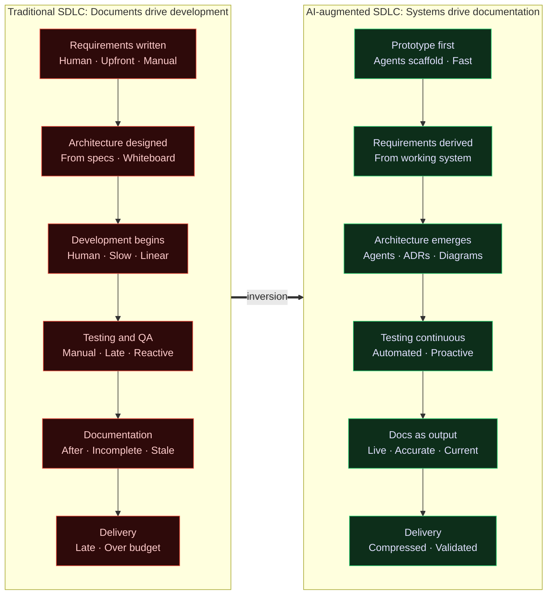
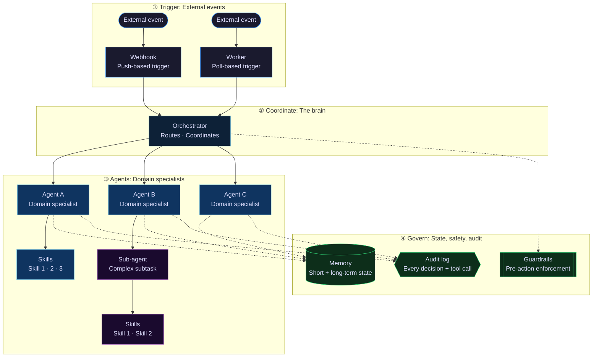
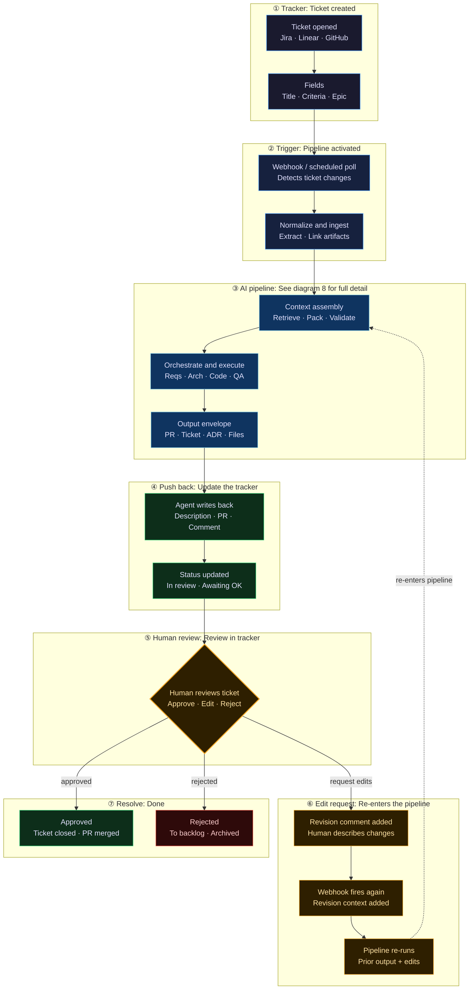
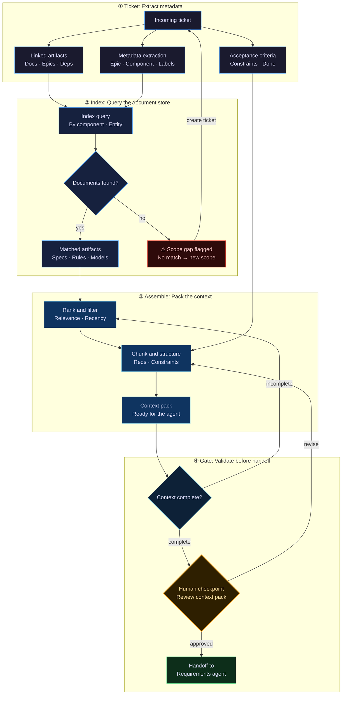
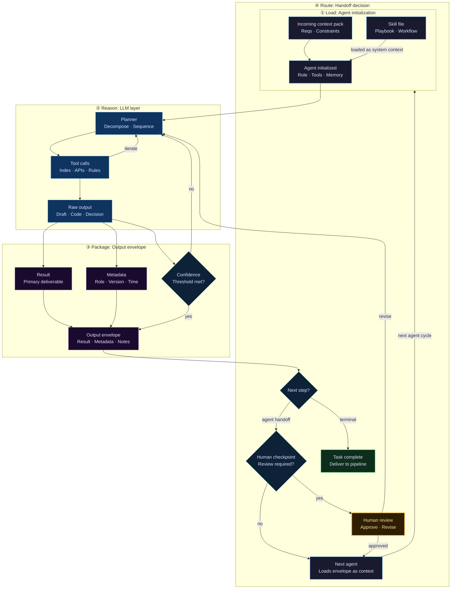
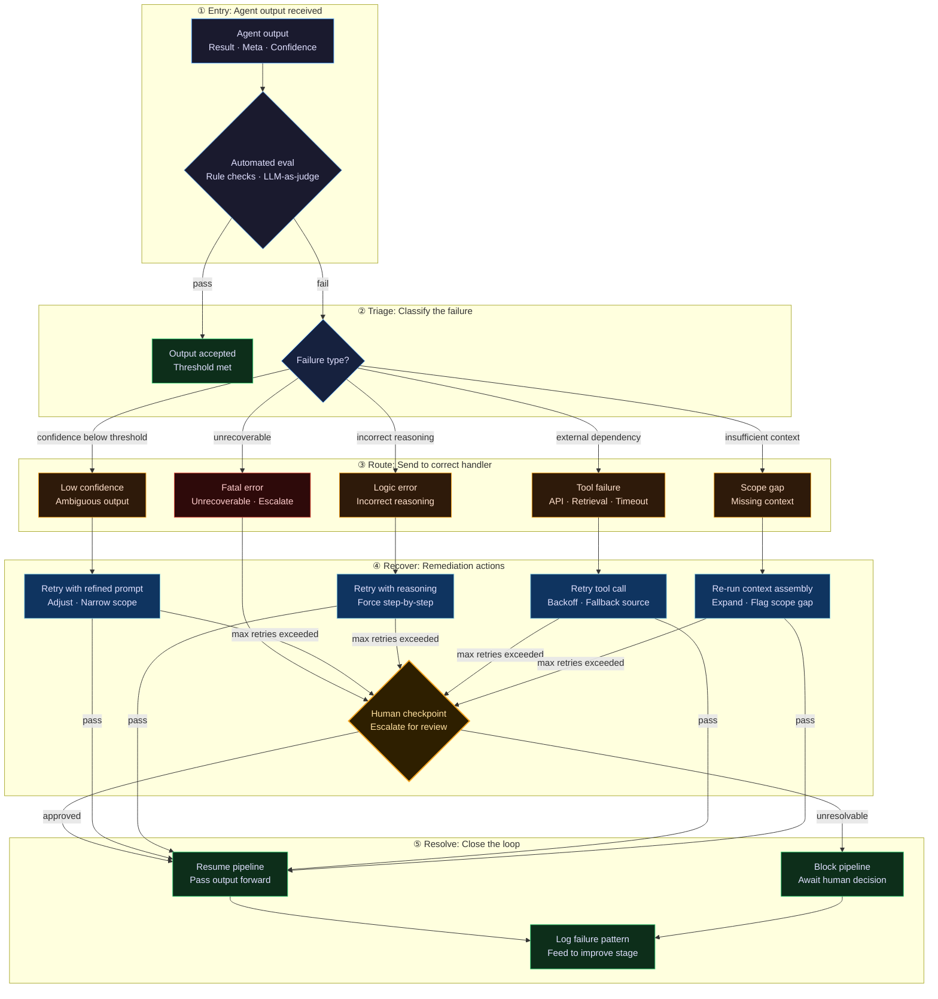
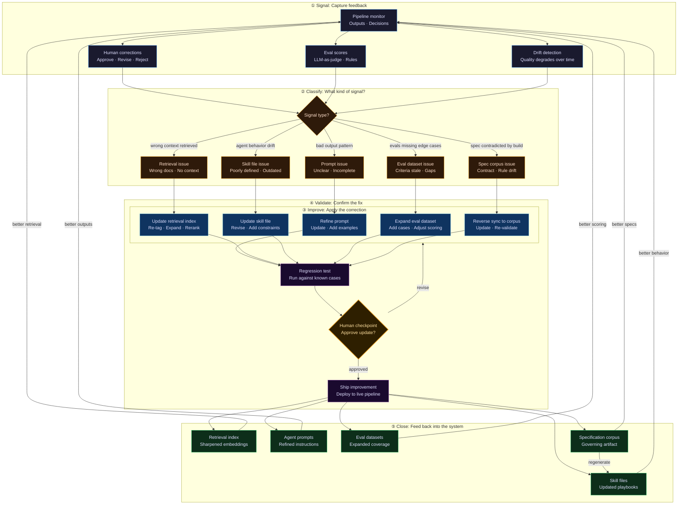

# Bryan J. Calabro

AI orchestration and agent architecture at Deloitte, based in Leesburg, VA. I design multi-agent systems, specification-driven build pipelines, and the web apps they ship.

**Solutions that are smart, useful, and a little dangerous.**

[bryancalabro.com](https://bryancalabro.com/) &nbsp;|&nbsp; [Research](https://research.bryancalabro.com/) &nbsp;|&nbsp; [LinkedIn](https://www.linkedin.com/in/bryancalabro/)

```
                (                   (        )
   (     (      )\ )    (       (   )\ )  ( /(
   )\    )\    (()/(    )\    ( )\ (()/(  )\())
 (((_)((((_)(   /(_))((((_)(  )((_) /(_))((_)\
 )\___ )\ _ )\ (_))   )\ _ )\((_)_ (_))    ((_)
((/ __|(_)_\(_)| |    (_)_\(_)| _ )| _ \  / _ \
 | (__  / _ \  | |__   / _ \  | _ \|   / | (_) |
  \___|/_/ \_\ |____| /_/ \_\ |___/|_|_\  \___/
```

**Recent apps**

<!-- recent-apps:start -->
<!-- generated by calabrodesign/scripts/profile-readme.mjs; edit there, not here -->

| Name | Tab | Description |
| --- | --- | --- |
| [Capitals](https://capitals.bryancalabro.com/) | Play | Drills every world capital by region, typed or pointed to on an SVG world map, with missed answers returning sooner so sessions target weak spots. |
| [FI](https://fi.bryancalabro.com/) | Tools | Estimates years to financial independence from your savings rate, plotting your point on that curve beside a withdrawal-rate sensitivity table. |
| [Five](https://five.bryancalabro.com/) | Play | Serves a daily five-letter word puzzle with a curated answer list, correct repeated-letter feedback, and a hard mode that enforces revealed hints. |
| [Pairs](https://pairs.bryancalabro.com/) | Play | Deals a memory matching game whose card faces are seeded SVG glyphs, so no two games look alike, with a two-player pass-and-play mode. |
| [Recall](https://recall.bryancalabro.com/) | Tools | Schedules flashcard reviews with SM-2 spaced repetition, stores each card's interval and ease, and says why a card is due; decks stay local. |
| [Tokens](https://tokens.bryancalabro.com/) | Tools | Counts a prompt's tokens across tokenizer families and prices it per model, labeling closed-model counts as estimates; text stays in the browser. |

<!-- recent-apps:end -->

## Architectures and frameworks

The same twelve diagrams are on the Method tab at [bryancalabro.com](https://bryancalabro.com/#method), drawn for light and dark, on a desktop screen.

<!-- systems:start -->
<!-- generated by calabrodesign/scripts/profile-readme.mjs; edit there, not here -->

<details>
<summary><b>1. Specification-driven build factory</b><br><i>One command, /new-app, carries a catalog record from idea to a verified live host. A factory run on demand stamps completion from evidence, and each run's lessons feed the rules the next build starts from.</i></summary>
<br>


```mermaid
flowchart TD
    subgraph RUN["① /new-app · One run, catalog record to verified live host"]
        direction TB
        N0["Pick record<br/>Build lane · Named · Idea<br/>→ One catalog record"]
        N1["Claim repo<br/>Ask GitHub, not catalog<br/>→ Empty private repo"]
        N2["Read the row<br/>/inventory row<br/>→ Host · Family · Stack"]
        N3["Research + look<br/>Mobbin · Random roll<br/>→ The app's own look"]
        N4["Scaffold<br/>Tokens · Footer · CI<br/>→ Zero-fail house audit"]
        N5["Provision<br/>/provision · Idempotent<br/>→ Project + host + www"]
        N6["Blueprint<br/>Full, ungated<br/>→ Acceptance checks"]
        N7["Build<br/>From the build prompt<br/>→ Verified in the app"]
        N9["Ship gates<br/>4G · Offline · No errors<br/>→ Observed, not assumed"]
        N10["Ship<br/>/ship · One version bump<br/>→ PR labeled greenfield"]
        N11["Greenfield merge<br/>Verify green → rebase<br/>→ Self-merged to main"]
        N12["Deploy + confirm<br/>READY · Canonical = host<br/>→ Verified live host"]
        N0 --> N1 --> N2 --> N3 --> N4
        N4 -->|scaffold becomes main| N5 --> N6 --> N7 --> N9
        N9 -.->|red · fix · re-verify| N7
        N9 --> N10 --> N11
        N11 -.->|verify red · fix · push| N10
        N11 --> N12
    end

    subgraph CONTROL["② Control plane · The catalog governs itself"]
        direction TB
        K1["Catalog<br/>specs/app-inventory<br/>→ One record per app"]
        K2["Inventory stamp<br/>On dispatch<br/>→ Completed from evidence"]
        K3["Queue<br/>/queue · One lane each<br/>→ Ranked fleet work"]
        K4["Pipeline<br/>/pipeline namekey<br/>→ The one next command"]
        K1 -.->|files every record| K3
        K3 -.->|one record| K4
        K2 -.->|stamp PR merges itself| K1
    end

    subgraph LEARN["③ Learning loop · Every build teaches the next"]
        direction TB
        N8["Phase ladder<br/>/phase · Later, optional<br/>→ Gate receipt"]
        R1["Phase learnings<br/>learnings.json<br/>→ Repo AGENTS.md"]
        R2["Retro<br/>/retro · docs/retros<br/>→ Closeout PR"]
        R3["House rules + skills<br/>Promoted only by PR<br/>→ Every next build"]
        R1 -.-> R2 -.->|house-rule + skill PRs| R3
    end

    K3 -.->|build lane| N0
    N0 -.->|idea writes its record first| K1
    N12 -.->|stamped on demand| K2
    K4 -.->|no project or domain| N5
    K4 -.->|gate red or regressed| N8
    K4 -.->|built, never deployed| N12
    N8 -.->|every phase| R1
    N12 -.->|run closes| R2
    N12 -.->|when conformance matters| N8
    R3 -.->|pre-wired in every scaffold| N4

    classDef lifeStyle fill:#1a1a2e,stroke:#4a9eff,color:#e0e0ff
    classDef govStyle fill:#1a0a2e,stroke:#9b59b6,color:#e0e0ff
    classDef learnStyle fill:#0d2e1a,stroke:#2ecc71,color:#e0e0ff

    class N0,N1,N2,N3,N4,N5,N6,N7,N9,N10,N11,N12 lifeStyle
    class K1,K2,K3,K4 govStyle
    class N8,R1,R2,R3 learnStyle
```

</details>

<details>
<summary><b>2. Forward deployed engineering methodology</b><br><i>Stages 0 to 10 of a closed loop that turns tacit institutional knowledge into production agents, with reverse sync sending what engineering learns back into the governing spec corpus.</i></summary>
<br>


```mermaid
flowchart TD
    subgraph LOOP["① Stages 0–10: Closed-loop methodology · Output per stage"]
        direction TB
        S0["Stage 0: Scope<br/>Capability boundaries<br/>→ Capability map"]
        S1["Stage 1: Extract<br/>Interviews + doc estate<br/>→ Normalized evidence"]
        S2["Stage 2: Synthesize<br/>Clean · Flag · Resolve<br/>→ Resolved rule sets"]
        S3["Stage 3: Encode<br/>Spec builder emits<br/>→ Canonical specs"]
        S4["Stage 4: Assemble<br/>Four layers, one corpus<br/>→ Specification corpus"]
        S5["Stage 5: Validate<br/>Confirm · Design evals<br/>→ Approved eval suite"]
        S6["Stage 6: Implement<br/>Build · Integrate · Test<br/>→ Discovered constraints"]
        S7["Stage 7: Reverse sync<br/>Discoveries → corpus<br/>→ Updated corpus"]
        S8["Stage 8: Generate<br/>Skills from valid specs<br/>→ Runtime skill library"]
        S9["Stage 9: Deploy<br/>Observe · Trace<br/>→ Telemetry + deviations"]
        S10["Stage 10: Iterate<br/>New evidence · Redeploy<br/>→ Refreshed corpus"]
        S0 --> S1 --> S2 --> S3 --> S4 --> S5 --> S6 --> S7 --> S8 --> S9 --> S10
        S7 -.->|reverse sync| S4
        S9 -.->|deviation to contract| S4
        S10 -.->|perpetual loop| S0
    end

    subgraph TIERS["② Three skill tiers: Never exposed beyond their layer"]
        direction TB
        RT[Runtime skills]
        SB[Spec-building skills]
        IM[Implementation skills]
    end

    S8 -.->|generated from corpus| RT
    S2 -.->|invoked across| SB
    S7 -.->|invoked across| SB
    S6 -.->|invoked at| IM

    classDef loopStyle fill:#1a1a2e,stroke:#4a9eff,color:#e0e0ff
    classDef tierStyle fill:#1a0a2e,stroke:#9b59b6,color:#e0e0ff

    class S0,S1,S2,S3,S4,S5,S6,S7,S8,S9,S10 loopStyle
    class RT,SB,IM tierStyle
```

**Related research:** [Forward Deployed Engineering Methodologies](https://research.bryancalabro.com/papers/forward-deployed-engineering)

</details>

<details>
<summary><b>3. Three phases maturity model</b><br><i>Three phases from human-driven orchestration to fully autonomous agent systems, and where most teams sit today.</i></summary>
<br>


```mermaid
flowchart LR
    subgraph P1["Phase 1: Human-driven"]
        direction TB
        P1A["Human as orchestrator<br/>Prompt · Direct · Decide"]
        P1B["LLM as tool<br/>On-demand · No memory"]
        P1C["Output quality<br/>Depends on prompt skill"]
        P1D["Speed gain<br/>Real but inconsistent"]
        P1E["Bottleneck<br/>Human availability"]
        P1A --> P1B --> P1C --> P1D --> P1E
    end

    P1 ==>|automate sequences| P2

    subgraph P2["Phase 2: Agent-assisted"]
        direction TB
        P2A["Agent as executor<br/>Handles task sequences"]
        P2B["Human at checkpoints<br/>Review · Approve · Act"]
        P2C["Skill files loaded<br/>Specialized role behavior"]
        P2D["Output quality<br/>Evals + human review"]
        P2E["Bottleneck<br/>Handoff + context clarity"]
        P2A --> P2B --> P2C --> P2D --> P2E
    end

    P2 ==>|close the loop| P3

    subgraph P3["Phase 3: Fully autonomous"]
        direction TB
        P3A["Agent as orchestrator<br/>Plan · Delegate · Correct"]
        P3B["Human at command layer<br/>Monitor · Goals · Override"]
        P3C["Feedback loops active<br/>System self-improves"]
        P3D["Output quality<br/>Systematic · Validated"]
        P3E["Bottleneck<br/>Goal clarity · Trust"]
        P3A --> P3B --> P3C --> P3D --> P3E
    end

    subgraph NOW["Where most teams are today"]
        POS["Somewhere between<br/>Phase 1 and Phase 2"]
    end

    P1 -.->|most teams| NOW
    P2 -.->|leading teams| NOW

    classDef p1Style fill:#2e0a0a,stroke:#e74c3c,color:#ffcccc
    classDef p2Style fill:#2e1f00,stroke:#f5a623,color:#ffe0a0
    classDef p3Style fill:#0d2e1a,stroke:#2ecc71,color:#e0e0ff
    classDef nowStyle fill:#16213e,stroke:#7ec8e3,color:#e0e0ff,stroke-dasharray:5 5

    class P1A,P1B,P1C,P1D,P1E p1Style
    class P2A,P2B,P2C,P2D,P2E p2Style
    class P3A,P3B,P3C,P3D,P3E p3Style
    class POS nowStyle
```

**Related research:** [Earned Autonomy](https://research.bryancalabro.com/papers/earned-autonomy)

</details>

<details>
<summary><b>4. SDLC inversion</b><br><i>How AI flips the SDLC: documents used to drive development, and now working systems drive the documentation.</i></summary>
<br>


```mermaid
flowchart LR
    subgraph BEFORE["Traditional SDLC: Documents drive development"]
        direction TB
        B1["Requirements written<br/>Human · Upfront · Manual"]
        B2["Architecture designed<br/>From specs · Whiteboard"]
        B3["Development begins<br/>Human · Slow · Linear"]
        B4["Testing and QA<br/>Manual · Late · Reactive"]
        B5["Documentation<br/>After · Incomplete · Stale"]
        B6["Delivery<br/>Late · Over budget"]
        B1 --> B2 --> B3 --> B4 --> B5 --> B6
    end

    BEFORE ==>|inversion| AFTER

    subgraph AFTER["AI-augmented SDLC: Systems drive documentation"]
        direction TB
        A1["Prototype first<br/>Agents scaffold · Fast"]
        A2["Requirements derived<br/>From working system"]
        A3["Architecture emerges<br/>Agents · ADRs · Diagrams"]
        A4["Testing continuous<br/>Automated · Proactive"]
        A5["Docs as output<br/>Live · Accurate · Current"]
        A6["Delivery<br/>Compressed · Validated"]
        A1 --> A2 --> A3 --> A4 --> A5 --> A6
    end

    classDef beforeStyle fill:#2e0a0a,stroke:#e74c3c,color:#ffcccc
    classDef afterStyle fill:#0d2e1a,stroke:#2ecc71,color:#e0e0ff

    class B1,B2,B3,B4,B5,B6 beforeStyle
    class A1,A2,A3,A4,A5,A6 afterStyle
```

**Related research:** [The Inversion of the SDLC](https://research.bryancalabro.com/papers/inversion-sdlc-adlc); [Human-Agent Centered Design](https://research.bryancalabro.com/papers/human-agent-centered-design-in-practice)

</details>

<details>
<summary><b>5. Stack layer diagram</b><br><i>The architecture stack, from foundation models and skill files up through agents and orchestration to the surfaces people use.</i></summary>
<br>


```mermaid
flowchart TD
    subgraph L1["⑤ Delivery surface: Where it becomes real"]
        API["REST API<br/>External consumers"]
        DASH["Internal dashboard<br/>Ops · Review · Command"]
        BATCH["Scheduled jobs<br/>Batch export · CI triggers"]
    end

    subgraph L2["④ Orchestration: The brain"]
        ROUTER["Task router<br/>Which agent · What order"]
        RETRY["Retry and error policy<br/>Failure · Fallback routes"]
        HANDOFF["Agent handoff<br/>Envelope · State transfer"]
        ROUTER --> HANDOFF
        ROUTER --> RETRY
        RETRY --> ROUTER
    end

    subgraph L3["③ Agentic layer: Where planning happens"]
        PLANNER["Planner<br/>Decompose · Sequence"]
        EXECUTOR["Executor<br/>Call tools · Run skills"]
        VALIDATOR["Validator<br/>Check · Score · Accept"]
        PLANNER --> EXECUTOR --> VALIDATOR
        VALIDATOR -->|retry| PLANNER
    end

    subgraph L4["② Skill files: How agents behave"]
        REQ["Requirements agent<br/>reqs-agent.md"]
        ARCH["Architecture agent<br/>arch-agent.md"]
        CODE["Code gen agent<br/>codegen-agent.md"]
        QA["QA agent<br/>qa-agent.md"]
    end

    subgraph L5["① Foundation: Models, retrieval and tools"]
        LLM["Foundation models<br/>Reasoning · Generation"]
        VEC["Vector index<br/>RAG · Semantic search"]
        RULES["Rule engine<br/>Deterministic validation"]
        APIS["External APIs<br/>Data sources · Services"]
    end

    L5 -->|context + reasoning| L4
    L4 -->|loaded as system context| L3
    L3 -->|planned tasks + output| L2
    L2 -->|validated results| L1

    classDef l1Style fill:#0d2e1a,stroke:#2ecc71,color:#e0e0ff
    classDef l2Style fill:#0d2137,stroke:#7ec8e3,color:#e0e0ff
    classDef l3Style fill:#0f3460,stroke:#7ec8e3,color:#e0e0ff
    classDef l4Style fill:#1a0a2e,stroke:#9b59b6,color:#e0e0ff
    classDef l5Style fill:#1a1a2e,stroke:#4a9eff,color:#e0e0ff

    class API,DASH,BATCH l1Style
    class ROUTER,RETRY,HANDOFF l2Style
    class PLANNER,EXECUTOR,VALIDATOR l3Style
    class REQ,ARCH,CODE,QA l4Style
    class LLM,VEC,RULES,APIS l5Style
```

**Related research:** [The Nervous System of Agentic AI](https://research.bryancalabro.com/papers/agentic-ai-sensing); [Forward Deployed Engineering Methodologies](https://research.bryancalabro.com/papers/forward-deployed-engineering)

</details>

<details>
<summary><b>6. Agent system topology</b><br><i>How triggers, the orchestrator, specialist agents, skills, and governance fit together at runtime.</i></summary>
<br>


```mermaid
flowchart TD
    subgraph TRIGGER["① Trigger: External events"]
        EV1([External event])
        EV2([External event])
        WH["Webhook<br/>Push-based trigger"]
        WK["Worker<br/>Poll-based trigger"]
        EV1 --> WH
        EV2 --> WK
    end

    subgraph COORD["② Coordinate: The brain"]
        ORC["Orchestrator<br/>Routes · Coordinates"]
        WH --> ORC
        WK --> ORC
    end

    subgraph AGENTS["③ Agents: Domain specialists"]
        AGa["Agent A<br/>Domain specialist"]
        AGb["Agent B<br/>Domain specialist"]
        AGc["Agent C<br/>Domain specialist"]
        SKa["Skills<br/>Skill 1 · 2 · 3"]
        SUB["Sub-agent<br/>Complex subtask"]
        SKb["Skills<br/>Skill 1 · Skill 2"]
        ORC --> AGa
        ORC --> AGb
        ORC --> AGc
        AGa --> SKa
        AGb --> SUB
        SUB --> SKb
    end

    subgraph GOVERN["④ Govern: State, safety, audit"]
        MEM[("Memory<br/>Short + long-term state")]
        GRD[["Guardrails<br/>Pre-action enforcement"]]
        AUD{{"Audit log<br/>Every decision + tool call"}}
        ORC -.-> GRD
        AGa -.-> MEM
        AGb -.-> MEM
        AGc -.-> MEM
        AGa -.-> AUD
        AGb -.-> AUD
        AGc -.-> AUD
    end

    classDef triggerStyle fill:#1a1a2e,stroke:#4a9eff,color:#e0e0ff
    classDef coordStyle fill:#0d2137,stroke:#7ec8e3,color:#e0e0ff
    classDef agentStyle fill:#0f3460,stroke:#7ec8e3,color:#e0e0ff
    classDef subStyle fill:#1a0a2e,stroke:#9b59b6,color:#e0e0ff
    classDef governStyle fill:#0d2e1a,stroke:#2ecc71,color:#e0e0ff

    class EV1,EV2,WH,WK triggerStyle
    class ORC coordStyle
    class AGa,AGb,AGc,SKa agentStyle
    class SUB,SKb subStyle
    class MEM,GRD,AUD governStyle
```

**Related research:** [Greenfield Versus Brownfield Agentic AI Integration](https://research.bryancalabro.com/papers/greenfield-vs-brownfield-agentic-ai-integration); [Earned Autonomy](https://research.bryancalabro.com/papers/earned-autonomy)

</details>

<details>
<summary><b>7. Ticket lifecycle and human revision loop</b><br><i>A ticket's full round trip: created in a tracker, run through the AI pipeline, returned for human review, and sent back through on an edit request.</i></summary>
<br>


```mermaid
flowchart TD
    subgraph TRACKER["① Tracker: Ticket created"]
        TK["Ticket opened<br/>Jira · Linear · GitHub"]
        TF["Fields<br/>Title · Criteria · Epic"]
        TK --> TF
    end

    subgraph TRIGGER["② Trigger: Pipeline activated"]
        WH["Webhook / scheduled poll<br/>Detects ticket changes"]
        NRM["Normalize and ingest<br/>Extract · Link artifacts"]
        TF --> WH --> NRM
    end

    subgraph PIPELINE["③ AI pipeline: See diagram 8 for full detail"]
        CTX["Context assembly<br/>Retrieve · Pack · Validate"]
        ORCH["Orchestrate and execute<br/>Reqs · Arch · Code · QA"]
        ENV["Output envelope<br/>PR · Ticket · ADR · Files"]
        NRM --> CTX --> ORCH --> ENV
    end

    subgraph PUSHBACK["④ Push back: Update the tracker"]
        UPD["Agent writes back<br/>Description · PR · Comment"]
        STAT["Status updated<br/>In review · Awaiting OK"]
        ENV --> UPD --> STAT
    end

    subgraph REVIEW["⑤ Human review: Review in tracker"]
        HR{"Human reviews ticket<br/>Approve · Edit · Reject"}
        STAT --> HR
    end

    subgraph EDITLOOP["⑥ Edit request: Re-enters the pipeline"]
        EC["Revision comment added<br/>Human describes changes"]
        WH2["Webhook fires again<br/>Revision context added"]
        RELOAD["Pipeline re-runs<br/>Prior output + edits"]
        EC --> WH2 --> RELOAD
    end

    subgraph RESOLVE["⑦ Resolve: Done"]
        APPROVE["Approved<br/>Ticket closed · PR merged"]
        REJECT["Rejected<br/>To backlog · Archived"]
        HR -->|approved| APPROVE
        HR -->|rejected| REJECT
    end

    HR -->|request edits| EC
    RELOAD -.->|re-enters pipeline| CTX

    classDef trackerStyle fill:#1a1a2e,stroke:#4a9eff,color:#e0e0ff
    classDef triggerStyle fill:#16213e,stroke:#4a9eff,color:#e0e0ff
    classDef pipelineStyle fill:#0f3460,stroke:#7ec8e3,color:#e0e0ff
    classDef pushbackStyle fill:#0d2e1a,stroke:#2ecc71,color:#e0e0ff
    classDef humanStyle fill:#2e1f00,stroke:#f5a623,color:#ffe0a0,stroke-width:2px
    classDef editStyle fill:#2e1f00,stroke:#f5a623,color:#ffe0a0
    classDef resolveStyle fill:#0d2e1a,stroke:#2ecc71,color:#e0e0ff
    classDef rejectStyle fill:#2e0a0a,stroke:#e74c3c,color:#ffcccc

    class TK,TF trackerStyle
    class WH,NRM triggerStyle
    class CTX,ORCH,ENV pipelineStyle
    class UPD,STAT pushbackStyle
    class HR humanStyle
    class EC,WH2,RELOAD editStyle
    class APPROVE resolveStyle
    class REJECT rejectStyle
```

**Related research:** [Human-Agent Centered Design](https://research.bryancalabro.com/papers/human-agent-centered-design-in-practice); [The Inversion of the SDLC](https://research.bryancalabro.com/papers/inversion-sdlc-adlc)

</details>

<details>
<summary><b>8. AI delivery pipeline</b><br><i>How tickets move from intake to deploy, with a human checkpoint at requirements, architecture, and release.</i></summary>
<br>


```mermaid
flowchart TD
    subgraph INTAKE["① Intake: Discover and scope"]
        JT["Ticket / epic<br/>User story · Criteria"]
        LD["Legacy artifacts<br/>Docs · Specs · Rules"]
        JT -->|linked artifacts| LD
    end

    subgraph INGEST["② Ingest: Normalize"]
        OCR["Document parser<br/>Extract → Markdown"]
        IDX["Index and tag<br/>Module · Process · Entity"]
        LD --> OCR --> IDX
        JT -->|ticket context| IDX
    end

    subgraph CONTEXT["③ Context: Retrieve and pack"]
        RAG["RAG retrieval<br/>By ticket / component"]
        CTX["Context pack<br/>Reqs · Constraints"]
        IDX --> RAG --> CTX
    end

    subgraph ORCHESTRATE["④ Orchestrate: Plan"]
        PLANNER["Requirements agent<br/>Decompose · Map · Rank"]
        HC1{"Human checkpoint<br/>Approve requirements"}
        ARCH["Architecture agent<br/>Design · ADRs · Diagrams"]
        HC2{"Human checkpoint<br/>Approve architecture"}
        CTX --> PLANNER --> HC1
        HC1 -->|approved| ARCH
        HC1 -->|revise| PLANNER
        ARCH --> HC2
        HC2 -->|revise| ARCH
    end

    subgraph EXECUTE["⑤ Execute: Build"]
        CODEGEN["Code gen agent<br/>Scaffold · Implement"]
        TESTGEN["Test gen agent<br/>Unit · Integration"]
        HC2 -->|approved| CODEGEN
        CODEGEN --> TESTGEN
    end

    subgraph VALIDATE["⑥ Validate: Review"]
        EVAL["Eval layer<br/>LLM-as-judge · Rule checks"]
        QA["QA agent<br/>Coverage · Regression"]
        HC3{"Human checkpoint<br/>Approve release"}
        TESTGEN --> EVAL --> QA --> HC3
        HC3 -->|revise| CODEGEN
    end

    subgraph DELIVER["⑦ Deliver: Ship"]
        PR["Pull request<br/>Code · Tests · Docs"]
        DEPLOY["CI/CD pipeline<br/>Build · Deploy · Release"]
        HC3 -->|approved| PR --> DEPLOY
    end

    subgraph OBSERVE["⑧ Observe: Learn"]
        MON["Monitor<br/>Drift · Failures · Edges"]
        IMPROVE["Improve<br/>→ Prompts · Index · Evals"]
        DEPLOY --> MON --> IMPROVE
        IMPROVE -->|refine retrieval| RAG
        IMPROVE -->|update scope| JT
    end

    classDef intakeStyle fill:#1a1a2e,stroke:#4a9eff,color:#e0e0ff
    classDef ingestStyle fill:#16213e,stroke:#4a9eff,color:#e0e0ff
    classDef contextStyle fill:#0f3460,stroke:#7ec8e3,color:#e0e0ff
    classDef orchStyle fill:#0d2137,stroke:#7ec8e3,color:#e0e0ff
    classDef execStyle fill:#1a0a2e,stroke:#9b59b6,color:#e0e0ff
    classDef valStyle fill:#2e0d1a,stroke:#e74c8b,color:#e0e0ff
    classDef delivStyle fill:#0d2e1a,stroke:#2ecc71,color:#e0e0ff
    classDef obsStyle fill:#2e2a0d,stroke:#f39c12,color:#e0e0ff
    classDef humanStyle fill:#2e1f00,stroke:#f5a623,color:#ffe0a0,stroke-width:2px

    class JT,LD intakeStyle
    class OCR,IDX ingestStyle
    class RAG,CTX contextStyle
    class PLANNER,ARCH orchStyle
    class CODEGEN,TESTGEN execStyle
    class EVAL,QA valStyle
    class PR,DEPLOY delivStyle
    class MON,IMPROVE obsStyle
    class HC1,HC2,HC3 humanStyle
```

**Related research:** [The Inversion of the SDLC](https://research.bryancalabro.com/papers/inversion-sdlc-adlc); [Forward Deployed Engineering Methodologies](https://research.bryancalabro.com/papers/forward-deployed-engineering)

</details>

<details>
<summary><b>9. Context assembly flow</b><br><i>How an unstructured ticket becomes a context pack an agent can work from, with a gate before handoff.</i></summary>
<br>


```mermaid
flowchart TD
    subgraph TICKET["① Ticket: Extract metadata"]
        TK[Incoming ticket]
        TM["Metadata extraction<br/>Epic · Component · Labels"]
        AC["Acceptance criteria<br/>Constraints · Done"]
        LK["Linked artifacts<br/>Docs · Epics · Deps"]
        TK --> TM
        TK --> AC
        TK --> LK
    end

    subgraph INDEX["② Index: Query the document store"]
        QRY["Index query<br/>By component · Entity"]
        HIT{Documents found?}
        MATCH["Matched artifacts<br/>Specs · Rules · Models"]
        FLAG["⚠ Scope gap flagged<br/>No match → new scope"]
        LK --> QRY
        TM --> QRY
        QRY --> HIT
        HIT -->|yes| MATCH
        HIT -->|no| FLAG
        FLAG -->|create ticket| TK
    end

    subgraph ASSEMBLE["③ Assemble: Pack the context"]
        RANK["Rank and filter<br/>Relevance · Recency"]
        CHUNK["Chunk and structure<br/>Reqs · Constraints"]
        CTX["Context pack<br/>Ready for the agent"]
        MATCH --> RANK --> CHUNK --> CTX
        AC --> CHUNK
    end

    subgraph GATE["④ Gate: Validate before handoff"]
        CHK{Context complete?}
        HC{"Human checkpoint<br/>Review context pack"}
        READY["Handoff to<br/>Requirements agent"]
        CHK -->|incomplete| RANK
        CTX --> CHK
        CHK -->|complete| HC
        HC -->|approved| READY
        HC -->|revise| CHUNK
    end

    classDef ticketStyle fill:#1a1a2e,stroke:#4a9eff,color:#e0e0ff
    classDef indexStyle fill:#16213e,stroke:#4a9eff,color:#e0e0ff
    classDef assembleStyle fill:#0f3460,stroke:#7ec8e3,color:#e0e0ff
    classDef gateStyle fill:#0d2137,stroke:#7ec8e3,color:#e0e0ff
    classDef flagStyle fill:#2e0a0a,stroke:#e74c3c,color:#ffcccc
    classDef humanStyle fill:#2e1f00,stroke:#f5a623,color:#ffe0a0,stroke-width:2px
    classDef readyStyle fill:#0d2e1a,stroke:#2ecc71,color:#e0e0ff

    class TK,TM,AC,LK ticketStyle
    class QRY,HIT,MATCH indexStyle
    class RANK,CHUNK,CTX assembleStyle
    class CHK gateStyle
    class FLAG flagStyle
    class HC humanStyle
    class READY readyStyle
```

**Related research:** [Forward Deployed Engineering Methodologies](https://research.bryancalabro.com/papers/forward-deployed-engineering); [The Inversion of the SDLC](https://research.bryancalabro.com/papers/inversion-sdlc-adlc)

</details>

<details>
<summary><b>10. Agent handoff flow</b><br><i>The loop inside one agent: load a skill, reason with tools, package the output, and route it to the next agent or a human.</i></summary>
<br>


```mermaid
flowchart TD
    subgraph LOAD["① Load: Agent initialization"]
        CTX["Incoming context pack<br/>Reqs · Constraints"]
        SF["Skill file<br/>Playbook · Workflow"]
        INIT["Agent initialized<br/>Role · Tools · Memory"]
        CTX --> INIT
        SF -->|loaded as system context| INIT
    end

    subgraph REASON["② Reason: LLM layer"]
        PLAN["Planner<br/>Decompose · Sequence"]
        TOOLS["Tool calls<br/>Index · APIs · Rules"]
        OUT["Raw output<br/>Draft · Code · Decision"]
        INIT --> PLAN --> TOOLS --> OUT
        TOOLS -->|iterate| PLAN
    end

    subgraph PACKAGE["③ Package: Output envelope"]
        RES["Result<br/>Primary deliverable"]
        META["Metadata<br/>Role · Version · Time"]
        CONF{"Confidence<br/>Threshold met?"}
        ENV["Output envelope<br/>Result · Metadata · Notes"]
        OUT --> RES
        OUT --> META
        OUT --> CONF
        CONF -->|no| PLAN
        RES --> ENV
        META --> ENV
        CONF -->|yes| ENV
    end

    subgraph ROUTE["④ Route: Handoff decision"]
        RTR{Next step?}
        HC{"Human checkpoint<br/>Review required?"}
        NEXT["Next agent<br/>Loads envelope as context"]
        HUMAN["Human review<br/>Approve · Revise"]
        DONE["Task complete<br/>Deliver to pipeline"]
        ENV --> RTR
        RTR -->|agent handoff| HC
        HC -->|no| NEXT
        HC -->|yes| HUMAN
        HUMAN -->|approved| NEXT
        HUMAN -->|revise| PLAN
        RTR -->|terminal| DONE
        NEXT -->|next agent cycle| LOAD
    end

    classDef loadStyle fill:#1a1a2e,stroke:#4a9eff,color:#e0e0ff
    classDef reasonStyle fill:#0f3460,stroke:#7ec8e3,color:#e0e0ff
    classDef packageStyle fill:#1a0a2e,stroke:#9b59b6,color:#e0e0ff
    classDef routeStyle fill:#0d2137,stroke:#7ec8e3,color:#e0e0ff
    classDef humanStyle fill:#2e1f00,stroke:#f5a623,color:#ffe0a0,stroke-width:2px
    classDef doneStyle fill:#0d2e1a,stroke:#2ecc71,color:#e0e0ff
    classDef flagStyle fill:#2e0a0a,stroke:#e74c3c,color:#ffcccc

    class CTX,SF,INIT loadStyle
    class PLAN,TOOLS,OUT reasonStyle
    class RES,META,ENV packageStyle
    class CONF,RTR,HC routeStyle
    class HUMAN humanStyle
    class DONE doneStyle
    class NEXT loadStyle
```

**Related research:** [Human-Agent Centered Design](https://research.bryancalabro.com/papers/human-agent-centered-design-in-practice); [The Inversion of the SDLC](https://research.bryancalabro.com/papers/inversion-sdlc-adlc)

</details>

<details>
<summary><b>11. Retry and error routing</b><br><i>How a failed output gets triaged by failure type, retried by the right handler, and escalated to a human when retries run out.</i></summary>
<br>


```mermaid
flowchart TD
    subgraph ENTRY["① Entry: Agent output received"]
        OUT["Agent output<br/>Result · Meta · Confidence"]
        EVAL{"Automated eval<br/>Rule checks · LLM-as-judge"}
        OUT --> EVAL
    end

    subgraph TRIAGE["② Triage: Classify the failure"]
        PASS["Output accepted<br/>Threshold met"]
        FAIL{Failure type?}
        EVAL -->|pass| PASS
        EVAL -->|fail| FAIL
    end

    subgraph ROUTES["③ Route: Send to correct handler"]
        LOW["Low confidence<br/>Ambiguous output"]
        LOGIC["Logic error<br/>Incorrect reasoning"]
        TOOL["Tool failure<br/>API · Retrieval · Timeout"]
        SCOPE["Scope gap<br/>Missing context"]
        FATAL["Fatal error<br/>Unrecoverable · Escalate"]
        FAIL -->|confidence below threshold| LOW
        FAIL -->|incorrect reasoning| LOGIC
        FAIL -->|external dependency| TOOL
        FAIL -->|insufficient context| SCOPE
        FAIL -->|unrecoverable| FATAL
    end

    subgraph RECOVER["④ Recover: Remediation actions"]
        R1["Retry with refined prompt<br/>Adjust · Narrow scope"]
        R2["Retry with reasoning<br/>Force step-by-step"]
        R3["Retry tool call<br/>Backoff · Fallback source"]
        R4["Re-run context assembly<br/>Expand · Flag scope gap"]
        HC{"Human checkpoint<br/>Escalate for review"}
        LOW --> R1
        LOGIC --> R2
        TOOL --> R3
        SCOPE --> R4
        FATAL --> HC
        R1 -->|max retries exceeded| HC
        R2 -->|max retries exceeded| HC
        R3 -->|max retries exceeded| HC
        R4 -->|max retries exceeded| HC
    end

    subgraph RESOLVE["⑤ Resolve: Close the loop"]
        RESUME["Resume pipeline<br/>Pass output forward"]
        LOG["Log failure pattern<br/>Feed to improve stage"]
        BLOCK["Block pipeline<br/>Await human decision"]
        HC -->|approved| RESUME
        HC -->|unresolvable| BLOCK
        R1 -->|pass| RESUME
        R2 -->|pass| RESUME
        R3 -->|pass| RESUME
        R4 -->|pass| RESUME
        RESUME --> LOG
        BLOCK --> LOG
    end

    classDef entryStyle fill:#1a1a2e,stroke:#4a9eff,color:#e0e0ff
    classDef triageStyle fill:#16213e,stroke:#4a9eff,color:#e0e0ff
    classDef routeStyle fill:#2e1a0a,stroke:#f39c12,color:#ffe0cc
    classDef recoverStyle fill:#0f3460,stroke:#7ec8e3,color:#e0e0ff
    classDef resolveStyle fill:#0d2e1a,stroke:#2ecc71,color:#e0e0ff
    classDef failStyle fill:#2e0a0a,stroke:#e74c3c,color:#ffcccc
    classDef humanStyle fill:#2e1f00,stroke:#f5a623,color:#ffe0a0,stroke-width:2px
    classDef passStyle fill:#0d2e1a,stroke:#2ecc71,color:#e0e0ff

    class OUT,EVAL entryStyle
    class PASS,FAIL triageStyle
    class LOW,LOGIC,TOOL,SCOPE routeStyle
    class FATAL failStyle
    class R1,R2,R3,R4 recoverStyle
    class HC humanStyle
    class RESUME,LOG,BLOCK resolveStyle
    class PASS passStyle
```

**Related research:** [Earned Autonomy](https://research.bryancalabro.com/papers/earned-autonomy); [The Inversion of the SDLC](https://research.bryancalabro.com/papers/inversion-sdlc-adlc)

</details>

<details>
<summary><b>12. Feedback loop</b><br><i>How every correction and failing eval flows back into the part of the system that caused it, from a prompt up to the spec corpus.</i></summary>
<br>


```mermaid
flowchart TD
    subgraph SIGNAL["① Signal: Capture feedback"]
        MON["Pipeline monitor<br/>Outputs · Decisions"]
        HF["Human corrections<br/>Approve · Revise · Reject"]
        EVAL["Eval scores<br/>LLM-as-judge · Rules"]
        DRIFT["Drift detection<br/>Quality degrades over time"]
        MON --> HF
        MON --> EVAL
        MON --> DRIFT
    end

    subgraph CLASSIFY["② Classify: What kind of signal?"]
        RTR{Signal type?}
        HF --> RTR
        EVAL --> RTR
        DRIFT --> RTR
        PROMPT["Prompt issue<br/>Unclear · Incomplete"]
        RETRIEVE["Retrieval issue<br/>Wrong docs · No context"]
        SKILL["Skill file issue<br/>Poorly defined · Outdated"]
        EVALDS["Eval dataset issue<br/>Criteria stale · Gaps"]
        SPEC["Spec corpus issue<br/>Contract · Rule drift"]
        RTR -->|bad output pattern| PROMPT
        RTR -->|wrong context retrieved| RETRIEVE
        RTR -->|agent behavior drift| SKILL
        RTR -->|evals missing edge cases| EVALDS
        RTR -->|spec contradicted by build| SPEC
    end

    subgraph IMPROVE["③ Improve: Apply the correction"]
        UP1["Refine prompt<br/>Update · Add examples"]
        UP2["Update retrieval index<br/>Re-tag · Expand · Rerank"]
        UP3["Update skill file<br/>Revise · Add constraints"]
        UP4["Expand eval dataset<br/>Add cases · Adjust scoring"]
        UP5["Reverse sync to corpus<br/>Update · Re-validate"]
        PROMPT --> UP1
        RETRIEVE --> UP2
        SKILL --> UP3
        EVALDS --> UP4
        SPEC --> UP5
    end

    subgraph VALIDATE["④ Validate: Confirm the fix"]
        TEST["Regression test<br/>Run against known cases"]
        HC{"Human checkpoint<br/>Approve update?"}
        SHIP["Ship improvement<br/>Deploy to live pipeline"]
        UP1 --> TEST
        UP2 --> TEST
        UP3 --> TEST
        UP4 --> TEST
        UP5 --> TEST
        TEST --> HC
        HC -->|revise| IMPROVE
        HC -->|approved| SHIP
    end

    subgraph CLOSE["⑤ Close: Feed back into the system"]
        IDX["Retrieval index<br/>Sharpened embeddings"]
        PROMPTS["Agent prompts<br/>Refined instructions"]
        SKILLS["Skill files<br/>Updated playbooks"]
        EVALS["Eval datasets<br/>Expanded coverage"]
        SPECS["Specification corpus<br/>Governing artifact"]
        SHIP --> IDX
        SHIP --> PROMPTS
        SHIP --> SKILLS
        SHIP --> EVALS
        SHIP --> SPECS
        IDX -->|better retrieval| MON
        PROMPTS -->|better outputs| MON
        SKILLS -->|better behavior| MON
        EVALS -->|better scoring| MON
        SPECS -->|regenerate| SKILLS
        SPECS -->|better specs| MON
    end

    classDef signalStyle fill:#1a1a2e,stroke:#4a9eff,color:#e0e0ff
    classDef classifyStyle fill:#2e1a0a,stroke:#f39c12,color:#ffe0cc
    classDef improveStyle fill:#0f3460,stroke:#7ec8e3,color:#e0e0ff
    classDef validateStyle fill:#1a0a2e,stroke:#9b59b6,color:#e0e0ff
    classDef closeStyle fill:#0d2e1a,stroke:#2ecc71,color:#e0e0ff
    classDef humanStyle fill:#2e1f00,stroke:#f5a623,color:#ffe0a0,stroke-width:2px

    class MON,HF,EVAL,DRIFT signalStyle
    class RTR,PROMPT,RETRIEVE,SKILL,EVALDS,SPEC classifyStyle
    class UP1,UP2,UP3,UP4,UP5 improveStyle
    class TEST,SHIP validateStyle
    class IDX,PROMPTS,SKILLS,EVALS,SPECS closeStyle
    class HC humanStyle
```

**Related research:** [Earned Autonomy](https://research.bryancalabro.com/papers/earned-autonomy); [Forward Deployed Engineering Methodologies](https://research.bryancalabro.com/papers/forward-deployed-engineering)

</details>

<!-- systems:end -->
